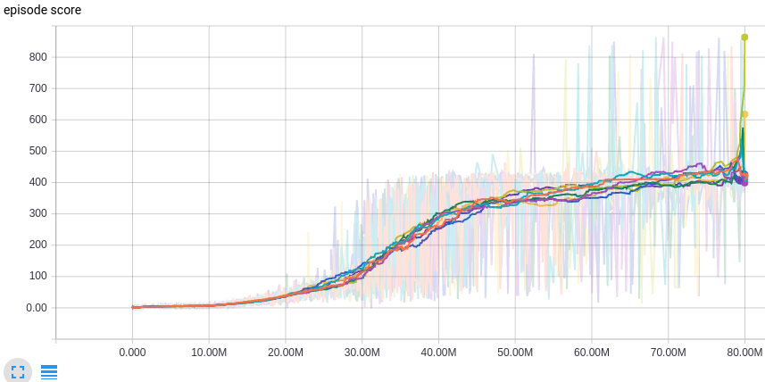
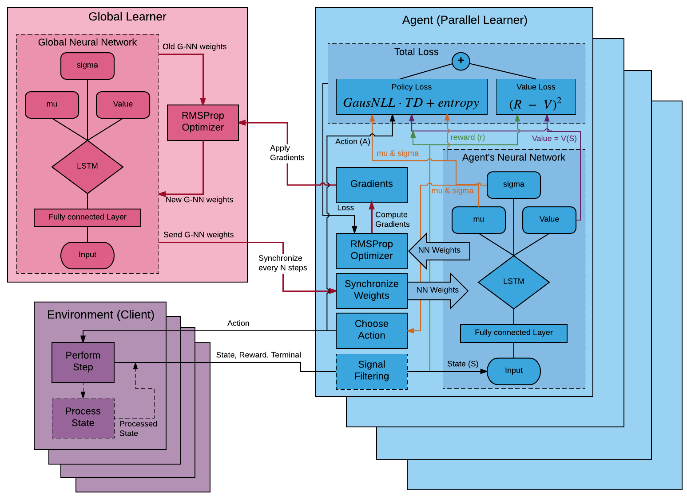

# REinforcement Learning Algorithms, Autoscaling and eXchange (RELAAX)

RELAAX is a framework designed to:

1. Simplify research and development of Reinforcement Learning applications by taking care of underlying infrastructure

2. Provide a usable and scalable implementation of state of the art Reinforcement Learning Algorithms

3. Ease deployment of Agents and Environments for training and exploitation of the trained Agents at scale on popular cloud platforms

The components of RELAAX include:

* [Reinforcement Learning eXchange (RLX) protocol](#reinforcement-learning-exchange-protocol) connects RL Agents with an RL Environment

* [RELAAX Client](#relaax-clients) wraps details of the [RLX Protocol](#reinforcement-learning-exchange-protocol) implementation and exposes simple API to be used to exchange States, Rewards, and Actions between the scalable RL Server and Environment. 

* [RELAAX Server](#relaax-server) allows developers to run RL Agents locally or at scale on popular cloud platforms. See more details below.

* RELAAX provides implementations of popular [RL algorithms](#algorithms) to simplify RL application development and research. 

* RELAAX is integrated into a hosted service where you can deploy your RL cluster on AWS, GCP, and Azure in just a few steps.

## Contents
- [Quick start](#quick-start)
- [System Architecture](#system-architecture)
- [RELAAX Clients](#relaax-clients)
    - [Reinforcement Learning eXchange protocol](#reinforcement-learning-exchange-protocol)
    - [Supported Environments](docs/Environments.md#supported-environments)
        - [ALE](docs/Environments.md#arcade-learning-environment)
        - [OpenAI Gym](docs/Environments.md#openai-gym)
        - [DeepMind Lab](docs/Environments.md#deepmind-lab)
- [RELAAX Server](#relaax-server)
    - [RLX Server](#rlx-server)
        - [RLX Server structure](#rlx-server-structure)
        - [RLX Server command line](#rlx-server-command-line)
        - [Configuration](#configuration)
    - [Worker](#worker)
        - [Worker structure](#worker-structure)
    - [Parameter Server](#parameter-server)
        - [Parameter Server structure](#parameter-server-structure)
        - [Parameter Server command line](#parameter-server-command-line)
    - [Algorithm](#algorithm)
        - [Algorithm package structure](#algorithm-package-structure)
        - [Worker-to-Parameter Server Bridge](#worker-to-parameter-server-bridge)
    - [Metrics](#metrics)
    - [RELAAX Installation](#relaax-installation)
        - [Installation for training on cluster and for algorithm development](#installation-for-training-on-cluster-and-for-algorithm-development)
        - [Installation for RELAAX development](#installation-for-relaax-development)
- [Algorithms](#algorithms)
    - [Distributed A3C](#distributed-a3c)
        - [Distributed A3C Architecture](#distributed-a3c-architecture)
        - [Performance on some of the Atari Environments](#performance-on-some-of-the-atari-environments)
    - [Distributed A3C Continuous](#distributed-a3c-continuous)
        - [Distributed A3C Architecture with Continuous Actions](#distributed-a3c-architecture-with-continuous-actions)
        - [Performance on gym's Walker](#performance-on-gyms-walker)
    - [Distributed TRPO with GAE](#distributed-trpo-with-gae)
        - [Performance on gym's BipedalWalker](#performance-on-gyms-bipedalwalker)
    - [Other Algorithms](#other-algorithms)
- [Deployment in Cloud](#deployment-in-cloud)


## [Quick start](#quick-start)

We recommended you use an isolated Python environment to run RELAAX.
Virtualenv or Anaconda are examples. If you're using the system's python environment,
you may need to run `pip install` commands with `sudo` and you also have to be sure
that you have `python-pip` installed.
On OSX / macOS, we recommend using [Homebrew](http://brew.sh/) to install a current python version.

* Install <a href="https://docs.docker.com/engine/installation/" target="_blank">Docker</a>

* Clone RELAAX repo.
```bash
git clone git@github.com:deeplearninc/relaax.git
```

* Install RELAAX
```bash
cd relaax
pip install -e .
```

* Build DA3C bridge.
```bash
algorithms/da3c/bridge/bridge.sh
```

* Install <a href="https://www.tensorflow.org/install/" target="_blank">TensorFlow</a>

* Create training directory
```bash
cd ..
mkdir training
cd training
```

* Build Docker image named gym (use sudo if needed):
```bash
docker build -f ../relaax/environments/OpenAI_Gym/Dockerfile -t gym ../relaax
```

* Open new terminal window, navigate to training directory and run parameter server
```bash
relaax-parameter-server --config ../relaax/config/da3c_gym_boxing.yaml
```

* Open new terminal window, navigate to training directory and run RLX server
```bash
relaax-rlx-server --config ../relaax/config/da3c_gym_boxing.yaml --bind 0.0.0.0:7001
```

* Use `ifconfig` command to find IP of your localhost. Remember it.

* Open new terminal window, navigate to training directory and run environment inside gym docker image. Use sudo if needed.
```bash
docker run -ti gym <LOCALHOST_IP>:7001 Boxing-v0
```

* Open new terminal window, navigate to trainin directory and run Tensorboard:
```bash
tensorboard --logdir metrics_gym_boxing
```

* Tensorboard prints URL to use. Open it in browser to exemain training progress.


## [System Architecture](#contents)


* Environment - computer simulation, game, or "hardware" in real world (say industrial manipulator, robot, car, etc.). To accelerate learning number of Environment(s) could be run in parallel.
* RELAAX Client - simple library which is embedded into Environment. It collects the State and Reward in Environment, sends it to the RELAAX Server, receives back Action(s) and communicates it to the Environment.
* RLX Server - listens on a port for a connection from the RELAAX Clients. After connection is accepted it starts Worker and passes control over communication with the client to that Worker.
* Worker - communicates with the client and runs Agent's NN. Each parallel replica of Environment/Client will have corresponding replica of the Agent.
* Parameter Server - one or several nodes which run Global Function NN (Q, value, or policy function). Parameter Server node(s) communicates with Workers over GRPC bridge to synchronize state of the Global Function NN with Agents.
* CheckPoints - storage where Parameter Server saves state of the Global Function NN; when system is re-stared, it may restore Global Function NN state from the stored previously checkpoint and continue learning.
* Metrics - Workers and Parameter Server send various metrics to the Metrics node; developer may see these metrics in Web Browser by connecting to the Metrics node.

## [RELAAX Clients](#contents)
Client is small library used to communicate with RL Agents. It could be used with the Environment implemented in many popular programming languages or embedded into specialized hardware systems. Currently client support Arcade Learning Environments (ALE), OpenAI Gym, and OpenAI Universe Environments. At the moment client implemented in Python, later on we are planning to implement client code in C/C++, Ruby, GO, etc. to simplify integration of other environments.

###  [Reinforcement Learning eXchange protocol](#contents)

Reinforcement Learning eXchange protocol is a simple protocol implemented over TCP using JSON (later will be moved to Protobuf). It allows to send State of the Environment and Reward to the Server and deliver Action from the Agent to the Environment.

TODO: links to actual files

```
relaax
  client
    rlx_client.py
      class Client                          - agent interface for environment
        def init(state)                     - start training sending initial state to agent,
                                              returns first action from agent
        def send(reward, state)             - send reward for previous action and current environment state,
                                              returns next action from agent
        def reset(reward)                   - send reward for previous action and resets agent
                                              returns cumulative reward for last episode
        def metrics()                       - get metrics object
        def disconnect()                    - disconnect environment from agent

      class Failure                         - raised in case of failure on agent's side
```


<br><br>

## [RELAAX Server](#contents)

### [RLX Server](#contents)

Main purpose of RLX Server is to run agents exploring and exploiting environments. You can run several RLX Servers on several computers. Run one RLX Server per computer. RLX Server starts, opens specified port and start listening it. When next client connects to the port, RLX Server accepts connection, forks itself as new process, starts new worker to process connection from client. Accepting connection means opening new connection on other port. So relax firewall rules on RLX Server node to allow connections on arbitrary ports.

RLX Server implements dynamic loading of algorithm code. Several examples of algorithms are in <relaax_repo>/algorithms. Feel free to copy and modify them according your needs.

RLX Server denies starting new worker in case of insufficient memory. To implement this feature on new connection RLX Server calculates mean memory consumption per child (worker) process and compares it with amount of available memory. Swap memory is not taken in account during comparison. If available memory is not enough RLX Server immediately closes new connection. Please note that typical client is trying to reconnect again in case of any network issue. This way load balancing and autoscaling is implemented. When load balancer routes new connection with overloaded RLX Server node RLX Server closes connection and client repeats connection attempt. Eventually, connection is routed to node with enough memory and training starts. Appropriate configuration of cluster autoscaler (based on low memory threshold) is required to utilize this feature.

Another balancing feature is regular connection drop on worker side. After specified timeout worker drops connection with client on next learning episode reset. Client automatically reconnects to load balancer allowing even load between working RLX Server nodes.

#### [RLX Server structure](#contents)

TODO: links to actual files

```
relaax
  server
    rlx_server
      main.py
        def main():     - parse command line,
                          read configuration YAML file and
                          run server.

      server.py TODO: introduce OO structure to server.py
        def run(...):   - load algorithm definition,
                          start listening incoming connections;
                        - on next incoming connection
                          check for available memory,
                          start a separate process.
                        - in a separate process
                          create new Agent,
                          create new Worker(Agent),
                          run new Worker.
```

#### [RLX Server command line](#contents)

When you install RELAAX on your node you've got `relaax-rlx-server` command.

If you're going to run training locally use following command line:
```bash
relaax-rlx-server --config config.yaml --bind localhost:7001 --parameter-server localhost:7000 --log-level WARNING
```

If you're going to run training on cluster use following command line. There are differences in parameter-server IP and timeout to enable load balancer:
```bash
relaax-rlx-server --config config.yaml --bind 0.0.0.0:7001 --parameter-server parameter-server:7000 --log-level WARNING --timeout 120
```

Available options are:
```bash
  -h, --help                    show help message and exit
  --config FILE                 configuration YAML file, see below
  --log-level LEVEL             set logging level (DEBUG, INFO, WARNING, ERROR, CRITICAL)
  --bind HOST:PORT              address to serve (host:port)
  --parameter-server HOST:PORT  parameter server address (host:port)
  --timeout TIMEOUT             worker stops on game reset after given timeout (no need to use it on local run)
```

#### [Configuration](#contents)

Both RLX Server (read workers) and Parameter server shares the same configuration file. The file describes algorithm to use and algorithm specific parameters.

Configuration file example (relaax/config/da3c_ale_boxing.yaml):
```yml
---
# relaax-parameter-server command line
relaax-parameter-server:
  --bind: localhost:7000
  --checkpoint-dir: checkpoints/boxing_a3c
  --log-level: WARNING
  --metrics-dir: metrics_ale_demo

# relaax-rlx-server command line
relaax-rlx-server:
  --bind: localhost:7001
  --parameter-server: localhost:7000
  --log-level: WARNING

# Number and meaning of these keys depends on specific algorithm.
# path to algorithm directory. In this case we use one from RELAAX repo. Feel free to create your own algorithm and use it for training.
algorithm:
  path: ../relaax/algorithms/da3c

  action_size: 4                  # action size for given game rom (18 fits ale boxing)
  episode_len: 5                  # local loop size for one episode
  gpu: false                      # to use GPU, set to the True
  lstm: false                     # to use LSTM instead of FF, set to the True
  max_global_step: 1e8            # amount of maximum global steps to pass through the training

  initial_learning_rate: 7e-4
  entropy_beta: 0.01              # entropy regularization constant
  rewards_gamma: 0.99             # rewards discount factor
  RMSProp:
    decay: 0.99
    epsilon: 0.1
    gradient_norm_clipping: 40
```

### [Worker](#contents)

Worker is main training unit. RLX Server starts worker as a separate process on new connection from client. New worker runs agent and provides communication between agent and environment inside client. Workers do not have separate configuration or command line. Both configuration and command line of worker are inherited from RLX server when worker is forked.

#### [Worker structure](#contents)

TODO: links to actual files
```
relaax
  server
    rlx_server
      worker.py
        class Worker
          def run(...): - using socket_protocol
                          run message loop between agent (local) and client (remote)
```

### [Parameter Server](#contents)

Parameter Server is to store and update agents' Global Function NN. Parameter Server is hub of star topology where workers are leaves. If selected algorithm allows sharding then Parameter Server could be distributed on several nodes (shards) depending on load.

Parameter Server is implemented as a GRPC Server. GRPC service definition depends on specific RL algorithm and is bundled with algorithm definition.

Parameter Server implements dynamic loading of algorithm code (same is true for workers). Several examples of algorithms are in RELAAX repo. Feel free to copy and modify them according your needs.

Parameter Server stores Global Function NN on local file system (convenient for local training) or on AWS S3 storage (must have for training on cluster).

Global Function NN states are stored in form of checkpoints. Each checkpoint is marked with training step number. This allows to store multiple checkpoints for the same training to investigate training progress. When Parameter Server starts it searches specified checkpoint location and loads last saved checkpoint.

Parameter Server saves checkpoint:
- on regular intervals, default 15 min, but it is possible to change in config.yaml
- if the training is over - algorithm reports that required number of training steps are done
- if it is stopped by SIGINT signal (Ctrl-C in terminal running Parameter Server for example)

#### [Parameter Server structure](#contents)

TODO: links to actual files
```
relaax
  server
    parameter_server
      main.py
        def main():     - parse command line,
                          read configuration YAML file,
                          configure checkpoint saver/loader and
                          run server.

      server.py TODO: introduce OO structure to server.py
        def run(...):   - load algorithm definition,
                          configure algorithm parameter server,
                          load latest checkpoint if any,
                          start parameter server in separate thread,
                          run monitor loop.
```

#### [Parameter Server command line](#contents)

When you install RELAAX on your node you've got `relaax-parameter-server` command.

If you're going to run training locally use following command line:
```bash
relaax-parameter-server --config config.yaml --bind localhost:7000 --log-level WARNING --checkpoint-dir training/checkpoints --checkpoint-time-interval 900 --checkpoints-to-keep 8 --metrics-dir training/metrics
```

If you're going to run training on cluster use following command line. There are differences in parameter-server IP and checkpoint and metrics locations:
```bash
relaax-parameter-server --config config.yaml --bind 0.0.0.0:7000 --log-level WARNING --checkpoint-aws-s3 my_bucket training/checkpoints --aws-keys aws-keys.yaml --checkpoint-time-interval 900 --checkpoints-to-keep 8 --metrics-dir training/metrics --metrics-aws-s3 my_bucket training/metrics
```

Available options are:
```bash
  -h, --help            show help message and exit
  --log-level LEVEL     set logging level (DEBUG, INFO, WARNING, ERROR, CRITICAL)
  --config FILE         configuration YAML file
  --bind HOST:PORT      address to serve (host:port)
  --checkpoint-dir DIR  training checkpoint directory
  --checkpoint-aws-s3 BUCKET KEY
                        AWS S3 bucket and key for training checkpoints
  --checkpoint-time-interval SECONDS
                        save on regular intervals in seconds
  --checkpoint-global-step-interval STEPS
                        save on regular intervals in global steps
  --checkpoints-to-keep N
                        number of checkpoints to keep
  --metrics-dir DIR     metrics data directory
  --metrics-aws-s3 BUCKET KEY
                        AWS S3 bucket and key for training metrics data
  --aws-keys FILE       YAML file containing AWS access and secret keys
```

It is possible to use both --checkpoint-dir and --checkpoint-aws-s3 flags in the same command line. In this case parameter server restores latest checkpoint (checkpoint having largest global step) from both location. Saving is doing in both locations.

Configuration file is the same as for RLX Server. Please use the same configuration for Parameter Server and for RLX Server. Otherwise training will fail.

You need to supply credentials to allow Parameter Server to use AWS S3. aws-keys.yaml file provides them:
```yml
---
access: YOUR_ACCESS_KEY_HERE
secret: YOUR_SECRET_ACCESS_KEY_HERE
```

### [Algorithm](#contents)

An algorithm is an usual Python package. But RELAAX server loads algorithms dynamically. Dynamic loading simplifies algorithm development outside Python package structure. The path to selected algorithm is defined in config.yaml or in command line.
All algorithms follow structure defined in relaax/algorithm_base directory:

```
relaax
  algorithm_base
    parameter_server_base.py
      class ParameterServerBase
        def __init__(config, saver_factory, metrics)     - initialize parameter server
        def close():                                     - close parameter server
        def restore_latest_checkpoint():                 - restore latest checkpoint
        def save_checkpoint():                           - save new checkpoint
        def global_t():                                  - return current global learning step
        def bridge():                                    - return bridge interface

    agent_base.py
      class AgentBase
        def act(state):                                  - take state and get action
        def reward_and_reset(reward):                    - take reward and reset training
        def reward_and_act(reward, state):               - take reward and state and get action
        def metrics():                                   - get metrics object

    bridge_base.py
      class BridgeBase
        def increment_global_t():                        - increment current global learning step
        def apply_gradients(gradients):                  - apply gradients to Global Function NN
        def get_values():                                - get Global Function NN
        def metrics():                                   - get metrics object

      class BridgeControlBase
        def parameter_server_stub(parameter_server_url): - return parameter server stub object
        def start_parameter_server(address, service):    - start parameter server with bind address and ParameterServerService object

    config_base.py
      class ConfigBase
        def __init__(config):                            - initializes configuration from loaded config.yaml
```

Algorithm package should exports following symbols:

```python
class Config(ConfigBase)                    - algorithm configuration

class ParameterServer(ParameterServerBase)  - implement parameter server for algorithm
TODO: simplify API
class Agent(AgentBase)                      - learning agent of algorithm

class Bridge(BridgeBase)                    - implement bridge between agent and parameter server

class BridgeControl(BridgeControlBase)      - control bridge between agent and parameter server
```

#### [Algorithm package structure](#contents)

TODO: links to actual files
TODO: complete
```
relaax
  algorithms
    da3c
      __init__.py                            - algorithm API (see previous section)
      common
        lstm.py                              - long short-term memory NN
        network.py                           - algorithm NN
        config.py
          class Config                       - algorithm configuration
            def __init__(config):            - initializes configuration from loaded config.yaml

        bridge
          bridge.sh                          - script to compile GRPC bridge

          bridge.proto                       - data bridge GRPC service
            service ParameterServer
              rpc IncrementGlobalT()         - increment and get current global learning step
              rpc ApplyGradients()           - apply gradients to Global Function NN
              rpc GetValues()                - get Global Function NN
              rpc StoreScalarMetric()        - store scalar metrics value

          bridge.py                          - data bridge between rlx_server and parameter server
                                               wrap GRPC service defined in bridge.proto
            class BridgeControl
              def parameter_server_stub():   - return parameter server stub object (BridgeBase)
              def start_parameter_server():  - start parameter server with bind address and BridgeBase object

      agent
        agent.py
          class Agent                        - learning agent of algorithm
            def act():                       - take state and get action
            def reward_and_act():            - take reward and state and get action
            def reward_and_reset():          - take reward and reset training
            def metrics():                   - get metrics object

        network.py                           - agent's facet of algorithm NN
          def make():                        - make agent's part of algorithm NN

      parameter_server
        network.py                           - parameter server's facet of algorithm NN
          def make():                        - make parameter server's part of algorithm NN

        parameter_server.py
          class ParameterServer              - implement parameter server for algorithm
            def __init__():                  - create new server
            def close():                     - close server
            def restore_latest_checkpoint(): - restore latest checkpoint using given checkpoint saver
            def save_checkpoint():           - save checkpoint using given checkpoint saver
            def global_t():                  - get current global learning step
            def bridge():                    - return bridge interface

```

#### [Worker-to-Parameter Server Bridge](#contents)

The purpose of the bridge is to provide data transport between workers and Parameter Server. Each worker and Parameter Server has it's own copy of Global Function NN. The bridge provides means of synchronization of these Global Functions and allows to distribute training process across different processes on different computational nodes.

Bridge is part of algorithm. Bridge is implemented as thin wrapper on GRPC service.

Minimal bridge GRPC service includes methods to update Global Function on Parameter Server and to receive synchronize Global Function on workers. This is GRPC service for Distributed A3C algorithm:
```
service ParameterServer {
    rpc IncrementGlobalT(NullMessage) returns (Step) {}
    rpc ApplyGradients(stream NdArray) returns (NullMessage) {}
    rpc GetValues(NullMessage) returns (stream NdArray) {}
    rpc StoreScalarMetric(ScalarMetric) returns (NullMessage) {}
}
```

Corresponding Parameter Server API looks like (relaax/algorithms/da3c/common/bridge/__init__.py):
```python
class ParameterServerService(object):
    def increment_global_t(self):
        # increments learning step on Parameter Server
        return global_t

    def apply_gradients(self, gradients):
        # applies gradients from Agent to Parameter Server

    def get_values(self):
        # pulls Global Function NN from Parameter Server to Agent
        return values

    def metrics():
        # get metrics object
        return metrics_object
```

### [Metrics](#contents)

Metrics is a way to gather information about training process in time. RELAAX uses TensorFlow to gather metrics and TensorBoard to present them. Metrics could be gathered from Parameter Server, workers (agents) and environments (clients).

Parameter server:
```python
self.metrics().scalar('training_velocity', velocity, x=parameter_server.global_t())
```

Agent:
```python
self.metrics().scalar('act latency', latency, x=agent.global_t)
```

Environment:
```python
client.metrics().scalar('act latency on client', latency)
```

This call stores metrics with given name and value. All metrics are stored as mappings from training global step to given values.
All metrics could be browsed in realtime during training by TensorBoard attached to training cluster or to local training.

DA3C gathers following metrics:
* episode reward
* episode length
* episode time
* reward per time
* policy loss
* value loss
* grad (with global norm)
* entropy
* agent action latency (with/without network latency)


### [RELAAX Installation](#contents)

It's recommended to use isolated Python environment to run RELAAX. Virtualenv or Anaconda are examples.

#### [Installation for training on cluster and for algorithm development](#contents)

* Install PIP - tool to install Python packages.

* Install TensorFlow (TODO: link)

* To install training environment clone RELAAX Git repository:
```bash
git clone git@github.com:deeplearninc/relaax.git
```

* Then navigate repository root and install relaax package and all depended packages:
```bash
cd <relaax_repo>
pip install .
```

#### [Installation for RELAAX development](#contents)

If you are going to modify RELAAX code itself then install it in "develop mode".

* Install PIP - tool to install Python packages.

* Install TensorFlow (TODO: link)

* clone RELAAX Git repository:
```bash
git clone TODO: add repo path
```

* Then navigate repository root and install relaax package and all depended packages:
```bash
cd <relaax_repo>
pip install -e .
```

* Build algorithm bridges
```bash
<relaax_repo>/relaax/algorithms/bridge.sh
```


## [Algorithms](#contents)

### [Distributed A3C](#contents)
Inspired by original [paper](https://arxiv.org/abs/1602.01783) - Asynchronous Methods for Deep Reinforcement Learning from [DeepMind](https://deepmind.com/)

#### [Distributed A3C Architecture](#contents)


**Environment (Client)** - each client connects to a particular Agent (Learner).

The main role of any client is feeding data to an Agent by transferring:
state, reward and terminal signals (for episodic tasks if episode ends).
Client updates these signals at each time step by receiving the action
signal from an Agent and then sends updated values to it.

- _Process State_: each state could be pass through some filtering
procedure before transferring (if you defined). It could be some color,
edge or blob transformations (for image input) or more complex
pyramidal, Kalman's and spline filters.

**Agent (Parallel Learner)** - one or more Agents can connect to a Global Learner.

The main role of any agent is to perform main training loop.
Agent synchronize their neural network weights with global network by
copying the last one at the beginning of the loop. Agent performs
N steps of Client's signals receiving and sending actions back.
These N steps is similar to batch collection. If batch is collected
Agent computes the loss (wrt collected data) and pass it to Optimizer.
RMSProp optimizer computes gradients, which sends to the Global Learner
to update their neural network weights. Several Agents work in parallel
and can update global network in concurrent way.

- _Agent's Neural Network_: we use the network architecture from this [Mnih's paper](https://arxiv.org/abs/1312.5602) (by default).
    - _Input_: 3D input to pass through 2D convolutions (default: 84x84x4).
    - _Convolution Layer #1_: 16 filters with 8x8 kernel and stride 4 in both directions, then ReLU applies (by default).
    - _Convolution Layer #2_: 32 filters with 4x4 kernel and stride 2 in both directions, then ReLU applies (by default).
    Sequence of two convolutions allows to define nonlinearity dependencies.
    - _Fully connected Layer_: consists of 256 hidden units, then ReLU applies (by default).
    - _Policy_: outputs number of units equals to action size, passed through softmax operator (by default).
    It is Actor's output, which represents Q-values on unity distribution (equals to probability) of state-action value function - Q(s, a).
    - _Value_: outputs one value without applying of additional operators (by default).
    It is Critic's output, which represents value function output V(s) - how well this state (equals to expected return from this point).

- _Total Loss_: it's scalar sum of value and policy loss.
    - _Value Loss_: sum (over all batch samples) of squared difference between
    total discounted reward (R) and a value of the current sample state - V(s),
    i.e. expected accumulated reward from this time step.
    `R = ri + gamma * V(s from N+1_step)`, where
     `ri` - immediate reward from this sample,
     `gamma` - discount factor (constant for the model),
     `V(s from N+1_step)` - value of the state next to the N-th state,
      if next state is terminal then `V = 0`.

    - _Policy Loss_: output of the policy (P) is an array of probability
     distribution over all possibly actions for the given sample state.
     Batch of samples is concatenated to the matrix.
     `Policy Loss = log(P) * A * TD + entropy`, where
     `A` - one-hot vectors for the chosen action of each sample.
     `log(P) * A` - produce sparse matrix, which we reduce to a column vector.
     `TD = (R - V)` - temporary difference between total discounted reward (R)
     and a value of the current sample state V(s) - produce column vector.
     `entropy = -sum(P * log(P), index=1) * entropy_beta_coefficient`,
     after multiplying the policy (P) likelihood we sum the result matrix
     by rows to produce a column vector. Then multiplying by `entropy_beta_coefficient = 0.01`
     Finally we sum up all column vectors and reduce it to a scalar.

- _Softmax Action_: we choose more often the actions, which has more probability.
It helps to explore a lot of state-action pairs at the beginning of the training.
We will become more confident in some actions while training
and the probability distribution is becoming more acute.
It also helps to solve a problem of "path along the cliff" with high reward at the end.

- _RMSProp Optimizer_: we use this type of optimizer wrt original paper.
RMSProp is more customizable optimizer than Adam for instance and you
can get better result if you fit it with appropriate parameters.
We set `learning rate = 7e-4` for RMSProp and linear anneal this value through
the training process wrt global training step. We also setup `decay = 0.99`
and `epsilon = 0.01` for the optimizer. Agent's RMSProp just used to
compute gradients wrt current Agent's neural network weights and given loss,
while all moments and slots of optimizer are stored (and shared) at Global Learner.

- _Gradients_: we clip computed gradients before transferring.

    `output_grads = computed_grads * 40.0 / l2norm(computed_grads)`

- _Synchronize Weights_: we copy weights from Global network to
Agent's network every training loop (N steps passed).

**Global Learner** - one for whole algorithm (training process).

The main role of the Global Learner is updating of its own neural network weights
by receiving gradients from the Agents and sending these weights to Agents
to synchronize. Global Learner can be sharded to speedup the training process.

- _Global Neural Network_: network architecture is similar to Agent's one.

- _RMSProp Optimizer_: has the same parameters as Agent's one,
but used only to apply receiving gradients. This RMSProp
stores moments and slots that are global for all Agents.

You can also specify hyperparameters for training in provided `params.yaml` file:

    episode_len: 5                  # training loop size for one batch
    max_global_step: 1e8            # amount of maximum global steps to pass through the training
    initial_learning_rate: 7e-4     # initial learning rate
    entropy_beta: 0.01              # entropy regularization constant
    rewards_gamma: 0.99             # discount factor for rewards
    RMSProp:                        # optimizer's parameters
       decay: 0.99
       epsilon: 0.1
       gradient_norm_clipping: 40

#### [Performance on some of the Atari Environments](#contents)
Breakout with DA3C-FF and 8 parallel agents: score performance is similar to DeepMind [paper](https://arxiv.org/pdf/1602.01783v2.pdf#19)


Boxing with DA3C-FF and 8 parallel agents: ih this case we outperforms significantly DeepMind, but
we have some instability in training process (anyway DeepMind shows only 34 points after 80mil steps)


### [Distributed A3C Continuous](#contents)
Distributed version of A3C algorithm, which can cope with continuous action space.
Inspired by original [paper](https://arxiv.org/abs/1602.01783) - Asynchronous Methods for Deep Reinforcement Learning from [DeepMind](https://deepmind.com/)

#### [Distributed A3C Architecture with Continuous Actions](#contents)


Most of the parts are the same to previous scheme, excluding:

- _Signal Filtering_: perform by Zfilter `y = (x-mean)/std` using running estimates of mean and std
 inspired by this [source](http://www.johndcook.com/blog/standard_deviation/). You can filter both
 states and rewards. We use it only for states by default.

- _Agent's (Global) Neural Network_: we use the similar architecture to [A3C paper](https://arxiv.org/pdf/1602.01783v2.pdf#12).
    Each continuous state passes some filtering procedure before transferring to _Input_ by default.
    - _Input_: vector of filtered state input (default: 24).
    - _Fully connected Layer_: consists of 128 hidden units, then ReLU applies (by default).
    - _LSTM_: consists of 128 memory cells (by default).
    - _Value_: outputs one value without applying of additional operators (by default).
    It is Critic's output, which represents value function output V(s) - how well this state (equals to expected return from this point).
    - _Policy_: Actor's output is divided separately on `mu` and `sigma`
        - _mu_: scalar of linear output.
        - _sigma_: applying SoftPlus operator, outputs a scalar.

    You can also specify your own architecture in provided JSON file.

- _Choose Action_: we use a random sampling wrt given `mu` and `sigma`

- _Total Loss_: it's scalar sum of value and policy loss.
    - _Value Loss_: the same to previous scheme.
    - _Policy Loss_: `GausNLL * TD + entropy`

    `GausNLL` is gaussian negative-log-likelihood

    `GausNLL = (sum(log(sigma), index=1) + batch_size * log(2*pi))/2 - sum(power, index=1)`,

     where `power = (A - mu)^2 * exp(-log(sigma)) * -0.5` - produce column vector.

     `TD = (R - V)` - temporary difference between total discounted reward (R)
     and a value of the current sample state V(s).

    `entropy = -sum(0.5 * log(2 * pi * sigma) + 1, index=1) * entropy_beta_coefficient`,

     resulting sparse matrix we sum over rows to produce column vector.

    `entropy_beta_coefficient = 0.001`

We also use a smaller `learning rate = 1e-4`

#### [Performance on gym's Walker](#contents)


##### [Server Latency](#contents)
Measure how fast Agent returns Action in response to the State sent by the Client

| Node Type  | Number of clients | Latency  |
| ---------- |:-----------------:|:--------:|
| m4.xlarge  |          32       | 323.23ms |
| m4.xlarge  |          48       | ???ms    |
| m4.xlarge  |          64       | ???ms    |
| c4.xlarge  |          48       | ???ms    |
| c4.xlarge  |          64       | ???ms    |
| c4.xlarge-m4.xlarge | 64       | ???ms    |
| c4.xlarge-m4.xlarge | 96       | ???ms    |
| c4.xlarge-m4.xlarge | 128      | ???ms    |
| c4.2xlarge |          232      | ???ms    |
| c4.2xlarge |          271      | ???ms    |

TBD - Latency chart (Show latency of the agents over time)


##### [Compute Performance with different amount of clients and node types (AWS)](#contents)

| Node Type  | Number of clients | Performance       |
| ---------- |:-----------------:| -----------------:|
| m4.xlarge  |          32       | 99 steps per sec  |
| m4.xlarge  |          48       | 167 steps per sec |
| m4.xlarge  |          64       | 171 steps per sec |
| c4.xlarge  |          48       | 169 steps per sec |
| c4.xlarge  |          64       | 207 steps per sec |
| c4.xlarge-m4.xlarge | 64       | 170 steps per sec |
| c4.xlarge-m4.xlarge | 96       | 167 steps per sec |
| c4.xlarge-m4.xlarge | 128      | 177 steps per sec |
| c4.2xlarge |          232      | 232 steps per sec |
| c4.2xlarge |          271      | 271 steps per sec |
<br><br>


### [Distributed TRPO with GAE](#contents)
Distributed version of TRPO-GAE algorithm, which can cope with both continuous & discrete action space.

Inspired by original papers:

- [Trust Region Policy Optimization](https://arxiv.org/abs/1502.05477)
- [High-Dimensional Continuous Control Using Generalized Advantage Estimation](https://arxiv.org/abs/1506.02438)

The main pipeline of the algorithm is the similar to the original sources, but collecting of
trajectories is performed independently by parallel agents. These agents have a copy of
policy neural network to rollout trajectories from its client.
Parameter server is blocked to update when the batch is collected and this procedure repeats.

#### [Performance on gym's BipedalWalker](#contents)
`batch_size == 10.000, trajectory_length == 1600, parallel_agents == 8`

<br><br>

### [Other Algorithms](#contents)
These other algorithms we are working on and planning to make them run on RELAAX server:

* ACER (A3C with experience)
Inspired by:
    - [Sample Efficient Actor-Critic with Experience Replay](https://arxiv.org/abs/1611.01224)

* UNREAL
Inspired by:
    - [Reinforcement Learning with Unsupervised Auxiliary Tasks](https://arxiv.org/abs/1611.05397)

* Distributed DQN (Gorila)
Inspired by:
    - [Massively Parallel Methods for Deep Reinforcement Learning](https://arxiv.org/abs/1507.04296)

* PPO with L-BFGS (similar to TRPO)
Inspired by:
    - [John Schulman's modular_rl repo](https://github.com/joschu/modular_rl)

* CEM
Inspired by:
    - [Cross-Entropy Method for Reinforcement Learning](https://esc.fnwi.uva.nl/thesis/centraal/files/f2110275396.pdf)

* DDPG
Inspired by:
    - [Continuous control with deep reinforcement learning](https://arxiv.org/abs/1509.02971)

## [Deployment in Cloud](#contents)

To train RL Agents at scale RELAAX Server and supported Environments could be deployed in the Cloud (AWS, GCP, Azure)


RELAAX comes with scripts and online service to allocate all required network components (VPC, subnets, load balancer), autoscaling groups, instances, etc. and provision software on on appropriate Instances.

**DA3C-LSTM with DeepMind's Lab clients**

| FPS | Number of Clients | Parameter Server | Environment | Worker (Agent) |
| --- |:-----------------:|:----------------:|:-----------:|:--------------:|
|  29 |         8         | r4.large / 400 MB / 10-15% CPU | r4.large / 2.1-2.3 GB / 95-100% CPU | r4.large / 1-1.4 GB / 30-40% CPU |
|  60 |        16         | c4.large / 350 MB / 20-25% CPU | c4.xlarge / 4.2-4.4 GB / 85-90% CPU | c4.large / 1.9-2.2 GB / 70-80% CPU |
|  61 |        18         | c4.large / 340 MB / 25% CPU | c4.xlarge / 4.8-4.9 GB / 90% CPU | c4.large / 2.2-2.5 GB / 65-70% CPU |
|  64 |        20         | c4.large / 340 MB / 25% CPU | c4.xlarge / 5.3-5.4 GB / 95% CPU | c4.large / 2.1-2.6 GB / 70% CPU |

**TRPO-GAE with OpenAI Gym's clients**

| FPS | Number of Clients | Parameter Server | Environment | Worker (Agent) |
| --- |:-----------------:|:----------------:|:-----------:|:--------------:|
| n/a |         8         | t2.micro / 310-320 MB / 100% CPU | t2.micro / 510-520 MB / 15% CPU | t2.micro / 360-480 / 20% CPU |
| 303 |        25         | c4.large / n/a / n/a | c4.large / n/a / n/a | c4.large / n/a / n/a |
