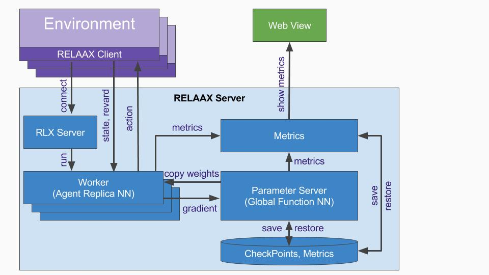
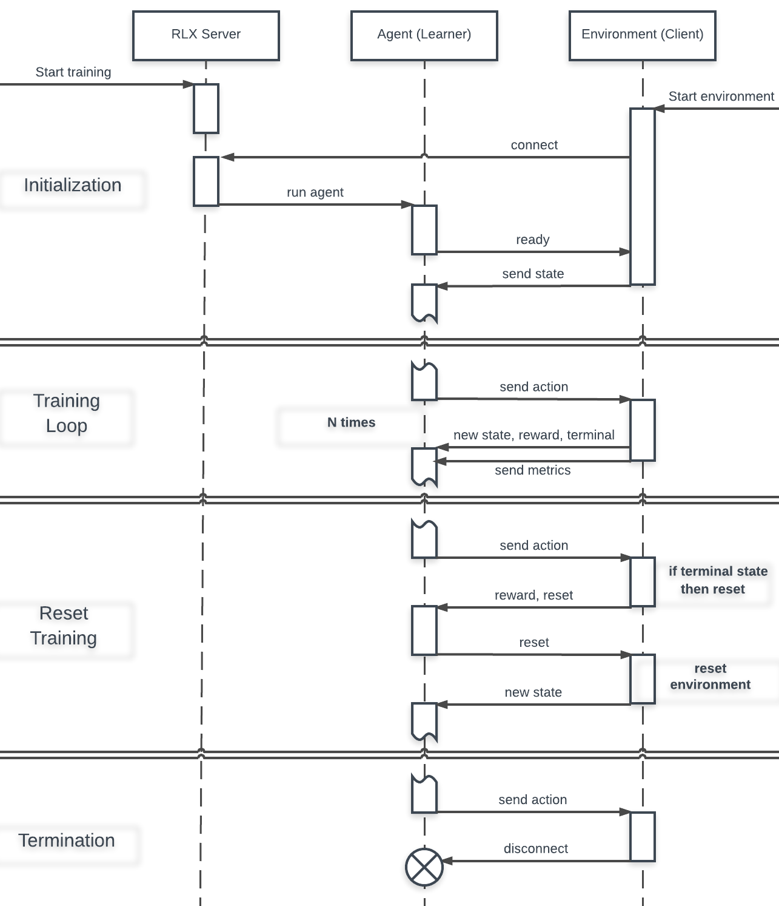
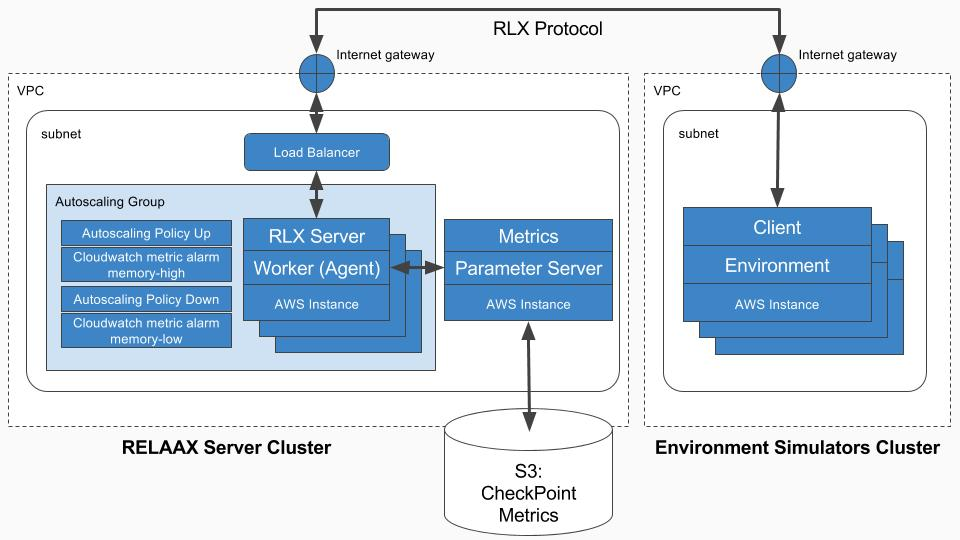

# REinforcement Learning Algorithms, Autoscaling and eXchange (RELAAX)

RELAAX is a framework designed to:

1. Simplify research and development of Reinforcement Learning applications by taking care of underlying infrastructure

2. Provide a usable and scalable implementation of state of the art Reinforcement Learning Algorithms

3. Ease deployment of Agents and Environments for training and exploitation of the trained Agents at scale on popular cloud platforms

The components of RELAAX include:

* [Reinforcement Learning eXchange (RLX) protocol](#reinforcement-learning-exchange-protocol) connects RL Agents with an RL Environment

* [RELAAX Agent Proxy](#relaax-agent-proxy) wraps details of the [RLX Protocol](#reinforcement-learning-exchange-protocol) implementation and exposes simple API to be used to exchange States, Rewards, and Actions between the scalable RL Server and Environment. 

* [RELAAX Server](#relaax-server) allows developers to run RL Agents locally or at scale on popular cloud platforms. See more details below.

* RELAAX provides implementations of popular [RL algorithms](#algorithms) to simplify RL application development and research. 

* RELAAX is integrated into a hosted service where you can deploy your RL cluster on AWS, GCP, and Azure in just a few steps.

## Contents
- [Quick start](#quick-start)
    - [Running on Windows](#run-windows)
- [System Architecture](#system-architecture)
- [RELAAX Agent Proxy](#relaax-agent-proxy)
    - [Reinforcement Learning eXchange protocol](#reinforcement-learning-exchange-protocol)
    - [Supported Environments](docs/Environments.md#supported-environments)
        - [ALE](docs/Environments.md#arcade-learning-environment)
        - [OpenAI Gym](docs/Environments.md#openai-gym)
        - [DeepMind Lab](docs/Environments.md#deepmind-lab)
- [RELAAX Server](#relaax-server)
    - [RLX Server](#rlx-server)
        - [RLX Server structure](#rlx-server-structure)
        - [RLX Server command line](#rlx-server-command-line)
        - [Configuration](#configuration)
    - [Worker](#worker)
        - [Worker structure](#worker-structure)
    - [Parameter Server](#parameter-server)
        - [Parameter Server structure](#parameter-server-structure)
        - [Parameter Server command line](#parameter-server-command-line)
    - [Algorithm](#algorithm)
        - [Algorithm package structure](#algorithm-package-structure)
        - [Worker-to-Parameter Server Bridge](#worker-to-parameter-server-bridge)
    - [Metrics](#metrics)
    - [RELAAX Installation](#relaax-installation)
        - [Installation for training on cluster and for algorithm development](#installation-for-training-on-cluster-and-for-algorithm-development)
        - [Installation for RELAAX development](#installation-for-relaax-development)
- [Algorithms](docs/Algorithms.md#algorithms)
    - [Distributed A3C](docs/Algorithms.md#distributed-a3c)
        - [Distributed A3C Architecture](docs/Algorithms.md#distributed-a3c-architecture)
        - [Performance on some of the Atari Environments](docs/Algorithms.md#performance-on-some-of-the-atari-environments)
    - [Distributed A3C Continuous](docs/Algorithms.md#distributed-a3c-continuous)
        - [Distributed A3C Architecture with Continuous Actions](docs/Algorithms.md#distributed-a3c-architecture-with-continuous-actions)
        - [Performance on gym's Walker](docs/Algorithms.md#performance-on-gyms-walker)
    - [Distributed TRPO with GAE](docs/Algorithms.md#distributed-trpo-with-gae)
        - [Performance on gym's BipedalWalker](docs/Algorithms.md#performance-on-gyms-bipedalwalker)
    - [Other Algorithms](docs/Algorithms.md#other-algorithms)
- [Deployment in Cloud](#deployment-in-cloud)


## [Quick start](#quick-start)

We recommended you use an isolated Python environment to run RELAAX.
Virtualenv or Anaconda are examples. If you're using the system's python environment,
you may need to run `pip install` commands with `sudo` and you also have to be sure
that you have `python-pip` installed.

* Clone RELAAX repo.
```bash
git clone git@github.com:deeplearninc/relaax.git
```

* Install RELAAX
```bash
cd relaax
pip install -e .[all]
```
Now you have relaax command available to create new applications, run it, configure algorithms, or generate environments and algorithms for your application. To see available options, run:
```bash
relaax --help
```

* Create new RELAAX application
```bash
relaax new app-name
cd app-name
```
This will create basic RL application with simple multi-handed bandit environment:

    app.yaml - contains configuration of environment, all servers, and algorithm
    environment - folder with environment and training regime implementation

You could see what other option are available by running: 
```bash
relaax new --help
```

* Run created application.
From your application folder, run: 
```bash
relaax run all
```
You could see what other option are available by running: 
```bash
relaax run --help
```

* Run different environment 
You could try other environments. From your application folder, run: 
```bash
relaax generate -e environment-name
```
To see what environments are available, run: 
```bash
relaax generate --help
```

* Different configurations
Different envoronments would require different algoritm configurations. To see list of available configurations, run:
```bash
relaax config
```
To see how to apply these configurations, run:
```
relaax config --help
```

* Local copy of algorithm implementation
If you would like to base your RL algorithm on RELAAX implementation or modify existing implementation you may copy algorithm in your app folder. From your application folder, run: 
```bash
relaax generate -a algorithm-name
```
To see what algorithms are available run: 
```bash
relaax generate --help
```

### [Running on Windows](#contents)

To run RELAAX on Windows you need to have NumPy, SciPy and tensorflow packages installed. Here is how to configure a separate Anaconda environment for running RELAAX on Windows:

```bash
(C:\Anaconda3) C:\Users\User>conda create -n relaax python=3.5 numpy scipy pillow psutil boto3 h5py click future ruamel_yaml colorama
(C:\Anaconda3) C:\Users\User>activate relaax
(relaax) C:\Users\User>
```
This command will create and activate a new Python 3.5 environment and install optimized NumPy and SciPy binaries, as well as some other packages.

```bash
(relaax) C:\Users\User>conda install -c conda-forge tensorflow
```
After that we install Tensorflow and it's dependencies from conda-forge channel. This version is optimized and compatible with previously installed NumPy and SciPy.

```bash
(relaax) C:\Users\User>pip install --no-deps grpcio grpcio_tools honcho==0.7.1
```
Finally we install packages that are not provided through Anaconda.
 
After these steps are complete, you can install the main RELAAX package:

```bash
(relaax) C:\Users\User>git clone git@github.com:deeplearninc/relaax.git
(relaax) C:\Users\User>cd relaax
(relaax) C:\Users\User\relaax>pip install -e .[all]
```

Now you can create a test environment to test if everything is working:
```bash
(relaax) C:\Users\User\relaax>cd ..
(relaax) C:\Users\User>relaax new app-name
(relaax) C:\Users\User>cd app-name
(relaax) C:\Users\User\app-name>relaax run all
```

This will run the test environment. You should see output in a separate console window. 

## [System Architecture](#contents)



* Environment - computer simulation, game, or "hardware" in real world (say industrial manipulator, robot, car, etc.). To accelerate learning number of Environment(s) could be run in parallel.
* RELAAX Agent Proxy - simple library which is embedded into Environment. It collects the State and Reward in Environment, sends it to the RELAAX Server, receives back Action(s) and communicates it to the Environment.
* RLX Server - listens on a port for a connection from the RELAAX Clients. After connection is accepted it starts Worker and passes control over communication with the client to that Worker.
* Worker - communicates with the client and runs Agent's NN. Each parallel replica of Environment/Client will have corresponding replica of the Agent.
* Parameter Server - one or several nodes which run Global Function NN (Q, value, or policy function). Parameter Server node(s) communicates with Workers over GRPC bridge to synchronize state of the Global Function NN with Agents.
* CheckPoints - storage where Parameter Server saves state of the Global Function NN; when system is re-stared, it may restore Global Function NN state from the stored previously checkpoint and continue learning.
* Metrics - Workers and Parameter Server send various metrics to the Metrics node; developer may see these metrics in Web Browser by connecting to the Metrics node.

## [RELAAX Agent Proxy](#contents)
Agent Proxy run with your Environments training and is used to communicate with RL Agents. At the moment client implemented in Python, later on we are planning to implement client code in C/C++, Ruby, GO, etc. to simplify integration of other environments.

Python API:

Available `from relaax.environment.agent_proxy import AgentProxy, AgentProxyException`

* `connect()` - connect to the Agent (through RLX server) 
* `init(expoit=False)` - send `init` command to the Agent to give it time to load model and do any other required initialization steps; you may use `exploit` flag to switch off exploration and traing of the model for the given Agent. Agent would copy latest trained weights from parameter server (PS) and do inferring, but wouldnt update model weights on PS.     
* `update(reward=None, state=None, terminal=False)` - send `update` to the Agent with state and reward and indication if this is terminal state or not 
* `reset()` - send `reset` command to the Agent
* `metrics.scalar` - send scalar to parameter server to add to the tensorboard metrics 

Agent Proxy is simple but requires certain amout of code to iitialize Agent, connection and reconnect to the Agents, handle exceptions, etc. To simplify all that even further, you may use `TrainingBase` class, which wrapps all details of the Agent Proxy operations. 

Python API:

Avalable `from relaax.environment.training import TrainingBase`

* `__init__` - use to instantiate your environment. Base calass will load configuration options and instantiate Agent Proxy. Agent Proxy will be available as self.agent. Following options will be loaded: 
    * `exploit` - passed to Agent Proxy `init` (this option is passed from commad line)
    * `environment/max_episodes` - how many apisodes to run
    * `environment/infinite_run` - don't stop after `max_episodes` reached
* `episode(self, number)` - called for each episode; return `episode_reward` from this method to capture `game_score` metric 

###  [Reinforcement Learning eXchange protocol](#contents)

Reinforcement Learning eXchange protocol is a simple protocol implemented over TCP using JSON. It allows to send State of the Environment and Reward to the Server and deliver Action from the Agent to the Environment.


<br><br>

## [RELAAX Server](#contents)

### [RLX Server](#contents)

Main purpose of RLX Server is to run agents exploring and exploiting environments. You can run several RLX Servers on several computers. Run one RLX Server per computer. RLX Server starts, opens specified port and start listening it. When next client connects to the port, RLX Server accepts connection, forks itself as new process, starts new worker to process connection from client. Accepting connection means opening new connection on other port. So relax firewall rules on RLX Server node to allow connections on arbitrary ports.

RLX Server implements dynamic loading of algorithm code. Several examples of algorithms are in <relaax_repo>/algorithms. Feel free to copy and modify them according your needs.

RLX Server denies starting new worker in case of insufficient memory. To implement this feature on new connection RLX Server calculates mean memory consumption per child (worker) process and compares it with amount of available memory. Swap memory is not taken in account during comparison. If available memory is not enough RLX Server immediately closes new connection. Please note that typical client is trying to reconnect again in case of any network issue. This way load balancing and autoscaling is implemented. When load balancer routes new connection with overloaded RLX Server node RLX Server closes connection and client repeats connection attempt. Eventually, connection is routed to node with enough memory and training starts. Appropriate configuration of cluster autoscaler (based on low memory threshold) is required to utilize this feature.

Another balancing feature is regular connection drop on worker side. After specified timeout worker drops connection with client on next learning episode reset. Client automatically reconnects to load balancer allowing even load between working RLX Server nodes.

#### [RLX Server structure](#contents)

TODO: links to actual files

```
relaax
  server
    rlx_server
      main.py
        def main():     - parse command line,
                          read configuration YAML file and
                          run server.

      server.py TODO: introduce OO structure to server.py
        def run(...):   - load algorithm definition,
                          start listening incoming connections;
                        - on next incoming connection
                          check for available memory,
                          start a separate process.
                        - in a separate process
                          create new Agent,
                          create new Worker(Agent),
                          run new Worker.
```

#### [RLX Server command line](#contents)

When you install RELAAX on your node you've got `relaax-rlx-server` command.

If you're going to run training locally use following command line:
```bash
relaax-rlx-server --config config.yaml --bind localhost:7001 --parameter-server localhost:7000 --log-level WARNING
```

If you're going to run training on cluster use following command line. There are differences in parameter-server IP and timeout to enable load balancer:
```bash
relaax-rlx-server --config config.yaml --bind 0.0.0.0:7001 --parameter-server parameter-server:7000 --log-level WARNING --timeout 120
```

Available options are:
```bash
  -h, --help                    show help message and exit
  --config FILE                 configuration YAML file, see below
  --log-level LEVEL             set logging level (DEBUG, INFO, WARNING, ERROR, CRITICAL)
  --bind HOST:PORT              address to serve (host:port)
  --parameter-server HOST:PORT  parameter server address (host:port)
  --timeout TIMEOUT             worker stops on game reset after given timeout (no need to use it on local run)
```

#### [Configuration](#contents)

Both RLX Server (read workers) and Parameter server shares the same configuration file. The file describes algorithm to use and algorithm specific parameters.

Configuration file example (relaax/config/da3c_ale_boxing.yaml):
```yml
---
# relaax-parameter-server command line
relaax-parameter-server:
  --bind: localhost:7000
  --checkpoint-dir: checkpoints/boxing_a3c
  --log-level: WARNING
  --metrics-dir: metrics_ale_demo

# relaax-rlx-server command line
relaax-rlx-server:
  --bind: localhost:7001
  --parameter-server: localhost:7000
  --log-level: WARNING

# Number and meaning of these keys depends on specific algorithm.
# path to algorithm directory. In this case we use one from RELAAX repo. Feel free to create your own algorithm and use it for training.
algorithm:
  path: ../relaax/algorithms/da3c

  action_size: 4                  # action size for given game rom (18 fits ale boxing)
  episode_len: 5                  # local loop size for one episode
  gpu: false                      # to use GPU, set to the True
  lstm: false                     # to use LSTM instead of FF, set to the True
  max_global_step: 1e8            # amount of maximum global steps to pass through the training

  initial_learning_rate: 7e-4
  entropy_beta: 0.01              # entropy regularization constant
  rewards_gamma: 0.99             # rewards discount factor
  RMSProp:
    decay: 0.99
    epsilon: 0.1
    gradient_norm_clipping: 40
```

### [Worker](#contents)

Worker is main training unit. RLX Server starts worker as a separate process on new connection from client. New worker runs agent and provides communication between agent and environment inside client. Workers do not have separate configuration or command line. Both configuration and command line of worker are inherited from RLX server when worker is forked.

#### [Worker structure](#contents)

TODO: links to actual files
```
relaax
  server
    rlx_server
      worker.py
        class Worker
          def run(...): - using socket_protocol
                          run message loop between agent (local) and client (remote)
```

### [Parameter Server](#contents)

Parameter Server is to store and update agents' Global Function NN. Parameter Server is hub of star topology where workers are leaves. If selected algorithm allows sharding then Parameter Server could be distributed on several nodes (shards) depending on load.

Parameter Server is implemented as a GRPC Server. GRPC service definition depends on specific RL algorithm and is bundled with algorithm definition.

Parameter Server implements dynamic loading of algorithm code (same is true for workers). Several examples of algorithms are in RELAAX repo. Feel free to copy and modify them according your needs.

Parameter Server stores Global Function NN on local file system (convenient for local training) or on AWS S3 storage (must have for training on cluster).

Global Function NN states are stored in form of checkpoints. Each checkpoint is marked with training step number. This allows to store multiple checkpoints for the same training to investigate training progress. When Parameter Server starts it searches specified checkpoint location and loads last saved checkpoint.

Parameter Server saves checkpoint:
- on regular intervals, default 15 min, but it is possible to change in config.yaml
- if the training is over - algorithm reports that required number of training steps are done
- if it is stopped by SIGINT signal (Ctrl-C in terminal running Parameter Server for example)

#### [Parameter Server structure](#contents)

TODO: links to actual files
```
relaax
  server
    parameter_server
      main.py
        def main():     - parse command line,
                          read configuration YAML file,
                          configure checkpoint saver/loader and
                          run server.

      server.py TODO: introduce OO structure to server.py
        def run(...):   - load algorithm definition,
                          configure algorithm parameter server,
                          load latest checkpoint if any,
                          start parameter server in separate thread,
                          run monitor loop.
```

#### [Parameter Server command line](#contents)

When you install RELAAX on your node you've got `relaax-parameter-server` command.

If you're going to run training locally use following command line:
```bash
relaax-parameter-server --config config.yaml --bind localhost:7000 --log-level WARNING --checkpoint-dir training/checkpoints --checkpoint-time-interval 900 --checkpoints-to-keep 8 --metrics-dir training/metrics
```

If you're going to run training on cluster use following command line. There are differences in parameter-server IP and checkpoint and metrics locations:
```bash
relaax-parameter-server --config config.yaml --bind 0.0.0.0:7000 --log-level WARNING --checkpoint-aws-s3 my_bucket training/checkpoints --aws-keys aws-keys.yaml --checkpoint-time-interval 900 --checkpoints-to-keep 8 --metrics-dir training/metrics --metrics-aws-s3 my_bucket training/metrics
```

Available options are:
```bash
  -h, --help            show help message and exit
  --log-level LEVEL     set logging level (DEBUG, INFO, WARNING, ERROR, CRITICAL)
  --config FILE         configuration YAML file
  --bind HOST:PORT      address to serve (host:port)
  --checkpoint-dir DIR  training checkpoint directory
  --checkpoint-aws-s3 BUCKET KEY
                        AWS S3 bucket and key for training checkpoints
  --checkpoint-time-interval SECONDS
                        save on regular intervals in seconds
  --checkpoint-global-step-interval STEPS
                        save on regular intervals in global steps
  --checkpoints-to-keep N
                        number of checkpoints to keep
  --metrics-dir DIR     metrics data directory
  --metrics-aws-s3 BUCKET KEY
                        AWS S3 bucket and key for training metrics data
  --aws-keys FILE       YAML file containing AWS access and secret keys
```

It is possible to use both --checkpoint-dir and --checkpoint-aws-s3 flags in the same command line. In this case parameter server restores latest checkpoint (checkpoint having largest global step) from both location. Saving is doing in both locations.

Configuration file is the same as for RLX Server. Please use the same configuration for Parameter Server and for RLX Server. Otherwise training will fail.

You need to supply credentials to allow Parameter Server to use AWS S3. aws-keys.yaml file provides them:
```yml
---
access: YOUR_ACCESS_KEY_HERE
secret: YOUR_SECRET_ACCESS_KEY_HERE
```

### [Algorithm](#contents)

An algorithm is an usual Python package. But RELAAX server loads algorithms dynamically. Dynamic loading simplifies algorithm development outside Python package structure. The path to selected algorithm is defined in config.yaml or in command line.
All algorithms follow structure defined in relaax/algorithm_base directory:

```
relaax
  algorithm_base
    parameter_server_base.py
      class ParameterServerBase
        def __init__(config, saver_factory, metrics)     - initialize parameter server
        def close():                                     - close parameter server
        def restore_latest_checkpoint():                 - restore latest checkpoint
        def save_checkpoint():                           - save new checkpoint
        def global_t():                                  - return current global learning step
        def bridge():                                    - return bridge interface

    agent_base.py
      class AgentBase
        def act(state):                                  - take state and get action
        def reward_and_reset(reward):                    - take reward and reset training
        def reward_and_act(reward, state):               - take reward and state and get action
        def metrics():                                   - get metrics object

    bridge_base.py
      class BridgeBase
        def increment_global_t():                        - increment current global learning step
        def apply_gradients(gradients):                  - apply gradients to Global Function NN
        def get_values():                                - get Global Function NN
        def metrics():                                   - get metrics object

      class BridgeControlBase
        def parameter_server_stub(parameter_server_url): - return parameter server stub object
        def start_parameter_server(address, service):    - start parameter server with bind address and ParameterServerService object

    config_base.py
      class ConfigBase
        def __init__(config):                            - initializes configuration from loaded config.yaml
```

Algorithm package should exports following symbols:

```python
class Config(ConfigBase)                    - algorithm configuration

class ParameterServer(ParameterServerBase)  - implement parameter server for algorithm
TODO: simplify API
class Agent(AgentBase)                      - learning agent of algorithm

class Bridge(BridgeBase)                    - implement bridge between agent and parameter server

class BridgeControl(BridgeControlBase)      - control bridge between agent and parameter server
```

#### [Algorithm package structure](#contents)

TODO: links to actual files
TODO: complete
```
relaax
  algorithms
    da3c
      __init__.py                            - algorithm API (see previous section)
      common
        lstm.py                              - long short-term memory NN
        network.py                           - algorithm NN
        config.py
          class Config                       - algorithm configuration
            def __init__(config):            - initializes configuration from loaded config.yaml

        bridge
          bridge.sh                          - script to compile GRPC bridge

          bridge.proto                       - data bridge GRPC service
            service ParameterServer
              rpc IncrementGlobalT()         - increment and get current global learning step
              rpc ApplyGradients()           - apply gradients to Global Function NN
              rpc GetValues()                - get Global Function NN
              rpc StoreScalarMetric()        - store scalar metrics value

          bridge.py                          - data bridge between rlx_server and parameter server
                                               wrap GRPC service defined in bridge.proto
            class BridgeControl
              def parameter_server_stub():   - return parameter server stub object (BridgeBase)
              def start_parameter_server():  - start parameter server with bind address and BridgeBase object

      agent
        agent.py
          class Agent                        - learning agent of algorithm
            def act():                       - take state and get action
            def reward_and_act():            - take reward and state and get action
            def reward_and_reset():          - take reward and reset training
            def metrics():                   - get metrics object

        network.py                           - agent's facet of algorithm NN
          def make():                        - make agent's part of algorithm NN

      parameter_server
        network.py                           - parameter server's facet of algorithm NN
          def make():                        - make parameter server's part of algorithm NN

        parameter_server.py
          class ParameterServer              - implement parameter server for algorithm
            def __init__():                  - create new server
            def close():                     - close server
            def restore_latest_checkpoint(): - restore latest checkpoint using given checkpoint saver
            def save_checkpoint():           - save checkpoint using given checkpoint saver
            def global_t():                  - get current global learning step
            def bridge():                    - return bridge interface

```

#### [Worker-to-Parameter Server Bridge](#contents)

The purpose of the bridge is to provide data transport between workers and Parameter Server. Each worker and Parameter Server has it's own copy of Global Function NN. The bridge provides means of synchronization of these Global Functions and allows to distribute training process across different processes on different computational nodes.

Bridge is part of algorithm. Bridge is implemented as thin wrapper on GRPC service.

Minimal bridge GRPC service includes methods to update Global Function on Parameter Server and to receive synchronize Global Function on workers. This is GRPC service for Distributed A3C algorithm:
```
service ParameterServer {
    rpc IncrementGlobalT(NullMessage) returns (Step) {}
    rpc ApplyGradients(stream NdArray) returns (NullMessage) {}
    rpc GetValues(NullMessage) returns (stream NdArray) {}
    rpc StoreScalarMetric(ScalarMetric) returns (NullMessage) {}
}
```

Corresponding Parameter Server API looks like (relaax/algorithms/da3c/common/bridge/__init__.py):
```python
class ParameterServerService(object):
    def increment_global_t(self):
        # increments learning step on Parameter Server
        return global_t

    def apply_gradients(self, gradients):
        # applies gradients from Agent to Parameter Server

    def get_values(self):
        # pulls Global Function NN from Parameter Server to Agent
        return values

    def metrics():
        # get metrics object
        return metrics_object
```

### [Metrics](#contents)

Metrics is a way to gather information about training process in time. RELAAX uses TensorFlow to gather metrics and TensorBoard to present them. Metrics could be gathered from Parameter Server, workers (agents) and environments (clients).

Parameter server:
```python
self.metrics().scalar('training_velocity', velocity, x=parameter_server.global_t())
```

Agent:
```python
self.metrics().scalar('act latency', latency, x=agent.global_t)
```

Environment:
```python
client.metrics().scalar('act latency on client', latency)
```

This call stores metrics with given name and value. All metrics are stored as mappings from training global step to given values.
All metrics could be browsed in realtime during training by TensorBoard attached to training cluster or to local training.

DA3C gathers following metrics:
* episode reward
* episode length
* episode time
* reward per time
* policy loss
* value loss
* grad (with global norm)
* entropy
* agent action latency (with/without network latency)


### [RELAAX Installation](#contents)

It's recommended to use isolated Python environment to run RELAAX. Virtualenv or Anaconda are examples.

#### [Installation for training on cluster and for algorithm development](#contents)

* Install PIP - tool to install Python packages.

* Install TensorFlow (TODO: link)

* To install training environment clone RELAAX Git repository:
```bash
git clone git@github.com:deeplearninc/relaax.git
```

* Then navigate repository root and install relaax package and all depended packages:
```bash
cd <relaax_repo>
pip install .
```

#### [Installation for RELAAX development](#contents)

If you are going to modify RELAAX code itself then install it in "develop mode".

* Install PIP - tool to install Python packages.

* Install TensorFlow (TODO: link)

* clone RELAAX Git repository:
```bash
git clone TODO: add repo path
```

* Then navigate repository root and install relaax package and all depended packages:
```bash
cd <relaax_repo>
pip install -e .
```

* Build algorithm bridges
```bash
<relaax_repo>/relaax/algorithms/bridge.sh
```
<br></br>

## [Deployment in Cloud](#contents)

To train RL Agents at scale RELAAX Server and supported Environments could be deployed in the Cloud (AWS, GCP, Azure)



RELAAX comes with scripts and online service to allocate all required network components (VPC, subnets, load balancer), autoscaling groups, instances, etc. and provision software on on appropriate Instances.

**DA3C-LSTM with DeepMind's Lab clients**

| FPS | Number of Clients | Parameter Server | Environment | Worker (Agent) |
| --- |:-----------------:|:----------------:|:-----------:|:--------------:|
|  29 |         8         | r4.large / 400 MB / 10-15% CPU | r4.large / 2.1-2.3 GB / 95-100% CPU | r4.large / 1-1.4 GB / 30-40% CPU |
|  60 |        16         | c4.large / 350 MB / 20-25% CPU | c4.xlarge / 4.2-4.4 GB / 85-90% CPU | c4.large / 1.9-2.2 GB / 70-80% CPU |
|  61 |        18         | c4.large / 340 MB / 25% CPU | c4.xlarge / 4.8-4.9 GB / 90% CPU | c4.large / 2.2-2.5 GB / 65-70% CPU |
|  64 |        20         | c4.large / 340 MB / 25% CPU | c4.xlarge / 5.3-5.4 GB / 95% CPU | c4.large / 2.1-2.6 GB / 70% CPU |

**TRPO-GAE with OpenAI Gym's clients**

| FPS | Number of Clients | Parameter Server | Environment | Worker (Agent) |
| --- |:-----------------:|:----------------:|:-----------:|:--------------:|
| n/a |         8         | t2.micro / 310-320 MB / 100% CPU | t2.micro / 510-520 MB / 15% CPU | t2.micro / 360-480 / 20% CPU |
| 303 |        25         | c4.large / n/a / n/a | c4.large / n/a / n/a | c4.large / n/a / n/a |
