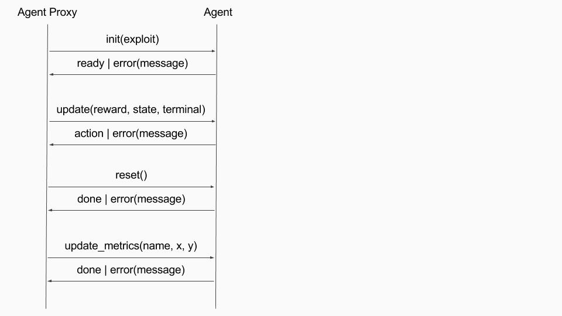

# REinforcement Learning Algorithms, Autoscaling and eXchange (RELAAX)

RELAAX is a framework designed to:

1. Simplify research and development of Reinforcement Learning applications by taking care of underlying infrastructure

2. Provide a usable and scalable implementation of state of the art Reinforcement Learning Algorithms

3. Ease deployment of Agents and Environments for training and exploitation of the trained Agents at scale on popular cloud platforms

The components of RELAAX include:

* [Reinforcement Learning eXchange (RLX) protocol](#reinforcement-learning-exchange-protocol) connects RL Agents with an RL Environment

* [RELAAX Agent Proxy](#relaax-agent-proxy) wraps details of the [RLX Protocol](#reinforcement-learning-exchange-protocol) implementation and exposes simple API to be used to exchange States, Rewards, and Actions between the scalable RL Server and Environment. 

* [RELAAX Server](#relaax-server) allows developers to run RL Agents locally or at scale on popular cloud platforms. See more details below.

* RELAAX provides implementations of popular [RL algorithms](#algorithms) to simplify RL application development and research. 

* RELAAX is integrated into a hosted service where you can deploy your RL cluster on AWS, GCP, and Azure in just a few steps.

## Contents
- [Quick start](#quick-start)
    - [Running on Windows](#running-on-windows)
- [System Architecture](#system-architecture)
- [RELAAX Agent Proxy](#relaax-agent-proxy)
    - [Reinforcement Learning eXchange protocol](#reinforcement-learning-exchange-protocol)
    - [Reinforcement Learning eXchange protocol definition](#reinforcement-learning-exchange-protocol-definition)
    - [Supported Environments](docs/Environments.md#supported-environments)
        - [ALE](docs/Environments.md#arcade-learning-environment)
        - [OpenAI Gym](docs/Environments.md#openai-gym)
        - [DeepMind Lab](docs/Environments.md#deepmind-lab)
- [RELAAX Server](#relaax-servers)
    - [RLX Server](#rlx-server)
    - [Parameter Server](#parameter-server)
- [Algorithms](docs/Algorithms.md#algorithms)
    - [Distributed A3C](docs/Algorithms.md#distributed-a3c)
        - [Distributed A3C Architecture](docs/Algorithms.md#distributed-a3c-architecture)
        - [Performance on some of the Atari Environments](docs/Algorithms.md#performance-on-some-of-the-atari-environments)
    - [Distributed A3C Continuous](docs/Algorithms.md#distributed-a3c-continuous)
        - [Distributed A3C Architecture with Continuous Actions](docs/Algorithms.md#distributed-a3c-architecture-with-continuous-actions)
        - [Performance on gym's Walker](docs/Algorithms.md#performance-on-gyms-walker)
    - [Distributed TRPO with GAE](docs/Algorithms.md#distributed-trpo-with-gae)
        - [Performance on gym's BipedalWalker](docs/Algorithms.md#performance-on-gyms-bipedalwalker)
    - [Other Algorithms](docs/Algorithms.md#other-algorithms)


## [Quick start](#quick-start)

We recommended you use an isolated Python environment to run RELAAX.
Virtualenv or Anaconda are examples. If you're using the system's python environment,
you may need to run `pip install` commands with `sudo` and you also have to be sure
that you have `python-pip` installed.

* Clone RELAAX repo.
```bash
git clone git@github.com:deeplearninc/relaax.git
```

* Install RELAAX
```bash
cd relaax
pip install -e .[all]
```
Now you have relaax command available to create new applications, run it, configure algorithms, or generate environments and algorithms for your application. To see available options, run:
```bash
relaax --help
```

* Create new RELAAX application
```bash
relaax new app-name
cd app-name
```
This will create basic RL application with simple multi-handed bandit environment:

    app.yaml - contains configuration of environment, all servers, and algorithm
    environment - folder with environment and training regime implementation

You could see what other option are available by running: 
```bash
relaax new --help
```

* Run created application.
From your application folder, run: 
```bash
relaax run all
```
You could see what other option are available by running: 
```bash
relaax run --help
```

* Run different environment 
You could try other environments. From your application folder, run: 
```bash
relaax generate -e environment-name
```
To see what environments are available, run: 
```bash
relaax generate --help
```

* Different configurations
Different envoronments would require different algoritm configurations. To see list of available configurations, run:
```bash
relaax config
```
To see how to apply these configurations, run:
```
relaax config --help
```

* Local copy of algorithm implementation
If you would like to base your RL algorithm on RELAAX implementation or modify existing implementation you may copy algorithm in your app folder. From your application folder, run: 
```bash
relaax generate -a algorithm-name
```
To see what algorithms are available run: 
```bash
relaax generate --help
```

### [Running on Windows](#contents)

To run RELAAX on Windows we recommend using [WinPython](https://winpython.github.io) distribution. We have tested WinPython 3.6.1.0Qt5 64bit version on Windows 8.1 and Windows 10. You will also need Microsoft Visual C++ Build Tools 14.00 if you want to use OpenAI Gym environments. You can download it [here](https://go.microsoft.com/fwlink/?LinkId=691126) or [here](http://landinghub.visualstudio.com/visual-cpp-build-tools).

Once you have installed these distributions you need to run "WinPython Command Prompt.exe", which is located in you WinPython installation directory. 
This will open a command prompt windows configured to use WinPython as Python distribution. After that you can install relaax using pip:
```bash
C:\WinPython-64bit-3.6.1.0Qt5>cd ..
C:\>git clone git@github.com:deeplearninc/relaax.git
C:\>cd relaax
C:\relaax>pip install -e .
```

This command will install relaax and it's dependencies under WinPython's Python environment. You will need run relaax from WinPython Command Prompt or create a custom shortcut for it.

To add OpenAI Gym support run the following comands (again, from WinPythonCommand Prompt):
```bash
C:\WinPython-64bit-3.6.1.0Qt5>pip install gym
C:\WinPython-64bit-3.6.1.0Qt5>pip install git+https://github.com/Kojoley/atari-py.git
```

Now you can create a test environment to test if everything is working:
```bash
C:\WinPython-64bit-3.6.1.0Qt5>cd ..
C:\relaax new bandit-test
C:\>cd bandt-test
C:\bandit-test>relaax run all
```
This will run a test environment with multi-armed bandit. You should see output in a separate console window. 

To test OpenAI Gym environment:
```bash
C:\WinPython-64bit-3.6.1.0Qt5>cd ..
C:\relaax new gym-test -e openai-gym
C:\>cd gym-test
C:\gym-test>relaax run all
```

This will run a CartPole-v0 environment. 

## [System Architecture](#contents)


* Environment - computer simulation, game, or "hardware" in real world (say industrial manipulator, robot, car, etc.). To accelerate learning number of Environment(s) could be run in parallel.
* RELAAX Agent Proxy - simple library which is embedded into Environment. It collects the State and Reward in Environment, sends it to the RELAAX Server, receives back Action(s) and communicates it to the Environment.
* RLX Server - listens on a port for a connection from the Environment. After connection is accepted it starts Agent and passes control over communication with Environment to that Agent.
* Parameter Server - one or several nodes which run Global Function NN (Q, value, or policy function). Parameter Server node(s) communicates with Agent over RPC bridge to synchronize state of the Global Function NN with Agents.
* CheckPoints - storage where Parameter Server saves state of the Global Function NN; when system is re-stared, it may restore Global Function NN state from the stored previously checkpoint and continue learning.
* Metrics - Evironment, Agent, and Parameter Server send various metrics to the Metrics node; developer may see these metrics in Web Browser by connecting to the Metrics node.

## [RELAAX Agent Proxy](#contents)
Agent Proxy run with your Environments training and is used to communicate with RL Agents. At the moment client implemented in Python, later on we are planning to implement client code in C/C++, Ruby, GO, etc. to simplify integration of other environments.

Python API:

Available `from relaax.environment.agent_proxy import AgentProxy, AgentProxyException`

* `connect()` - connect to the Agent (through RLX server) 
* `init(expoit=False)` - send `init` command to the Agent to give it time to load model and do any other required initialization steps; you may use `exploit` flag to switch off exploration and traing of the model for the given Agent. Agent would copy latest trained weights from parameter server (PS) and do inferring, but wouldnt update model weights on PS.     
* `update(reward=None, state=None, terminal=False)` - send `update` to the Agent with state and reward and indication if this is terminal state or not 
* `reset()` - send `reset` command to the Agent
* `metrics.scalar` - send scalar to parameter server to add to the tensorboard metrics 

Agent Proxy is simple but requires certain amout of code to iitialize Agent, connection and reconnect to the Agents, handle exceptions, etc. To simplify all that even further, you may use `TrainingBase` class, which wrapps all details of the Agent Proxy operations. 

Python API:

Avalable `from relaax.environment.training import TrainingBase`

* `__init__` - use to instantiate your environment. Base calass will load configuration options and instantiate Agent Proxy. Agent Proxy will be available as self.agent. Following options will be loaded: 
    * `exploit` - passed to Agent Proxy `init` (this option is passed from commad line)
    * `environment/max_episodes` - how many apisodes to run
    * `environment/infinite_run` - don't stop after `max_episodes` reached
* `episode(self, number)` - called for each episode; return `episode_reward` from this method to capture `game_score` metric 

###  [Reinforcement Learning eXchange protocol](#contents)

Reinforcement Learning eXchange protocol is a simple binary protocol implemented over TCP. It allows to send State of the Environment and Reward to the Server and deliver Action from the Agent to the Environment.


<br><br>

###  [Reinforcement Learning eXchange protocol definition](#contents)

#### Message exchange:

{'command': 'init', 'exploit': False|True} -> {'response': 'ready'} OR {'response': 'error', 'message': 'can\'t initialize agent'}

{'command': 'update', 'terminal': False|True, 'state': [], 'reward': 1} -> {'response': 'action', 'data': 1} OR {'response': 'error', 'message': 'can\'t update state'}

{'command': 'reset'} -> {'response': 'done'} OR {'response': 'error', 'message': 'can\'t reset agent'}

{'command': 'update_metrics', 'name': name, 'y': y, 'x': x} -> {'response': 'done'} OR {'response': 'error', 'message': 'can\'t update metrics'}

'reward' can be TYPE_NULL, TYPE_DOUBLE or TYPE_LIST(TYPE_DOUBLE)<br>
'state' can be TYPE_IMAGE, TYPE_LIST or TYPE_NDARRAY<br>
'data' can be TYPE_INT4, TYPE_DOUBLE or TYPE_LIST

#### Basic types:

Name | Value | Size in bytes
-----|-------|--------------
TYPE_NONE|0|0
TYPE_NULL|           1|       0
TYPE_INT4 |          2|       4
TYPE_STRING_UTF8|    3|       variable
TYPE_DOUBLE|         4|       8
TYPE_BOOLEAN|        5|       1
TYPE_IMAGE|          6|       variable
TYPE_NDARRAY|        7|       variable
TYPE_LIST|           8|       variable
TYPE_UINT4|          9|       4

#### Message format:
| "[size in bytes]:"| key value0 | ... | key valueN | ","

#### Key/Typed Value format:
| Key name(TYPE_STRING_UTF8)| Type(1 byte) | Value |

#### TYPE_BOOLEAN value:
| 0(False)/1(True) |

#### TYPE_STRING_UTF8 value:
| Length in bytes(TYPE_UINT4) | bytes UTF8 |

#### TYPE_IMAGE value:
| image type(TYPE_STRING_UTF8) | xdim(TYPE_UINT4) | ydim(TYPE_UINT4) | Length in bytes(TYPE_UINT4) | bytes |

image type values: BMP, JPG etc

#### TYPE_NDARRAY value:
| shapes count(TYPE_UINT4) | shape0 |...| shapeN | Length in bytes(TYPE_UINT4) | bytes |

#### TYPE_LIST value:
| number of items(TYPE_UINT4) | item0 |...| itemN |

## [RELAAX Servers](#contents)

RELAAX Server implements dynamic loading of the algorithm implementation. By convention, every algorithm implementation exposes Agent (agent.py) and ParameterServer (parameter_server.py) classes. RLX Server loads and instattiate Agent model for every incomming connection from Environment. There usually single Parameter Server (PS). PS loads and instantiate ParameterServer class. Every Agent gets RPC connection to PS and could call remotely methods exposed on PS model.

Model(s) on PS should be registered with Session and methods exposed to RPC using Op method. See [samples/simple-exchange-js/algorithm/](samples/simple-exchange-js/algorithm/) to very basic sample of the Agent, ParameterServer, and Model implementation and data exchange between them.

### [RLX Server](#contents)

Agent API:

* `__init__(self, parameter_server)` - Agent instance constructed with pointer to PS which coulld be used to call methods on PS using RPC
* `init(self, exploit=False)` - called by the Environment (Agent Proxy) to give Agent time to initialize, load model, and do all necessary preporation to star.
* `update(self, reward, state, terminal)` - receive state and reward from the Environmet and should return back action. Terminal indicates terminal state.
* `reset(self)` - sent by Environment (Agent Proxy) to reset Agent

### [Parameter Server](#contents)

ParameterServer API:

* `init(self)` - called when ParameterServer class instantiated. At this point PS should load Model/NN and register it with Session which is used to call model methods. For example:
```
from relaax.server.common.session import Session
from .model import SharedParameters 
...
def init(self):
  self.session = Session(SharedParameters())
...
```
* `close(self)` - called before PS is stopped to close session.
* `create_checkpoint(self)` - called by PS to create check point of the Model. 
* `get_session(self)` - should return session.
