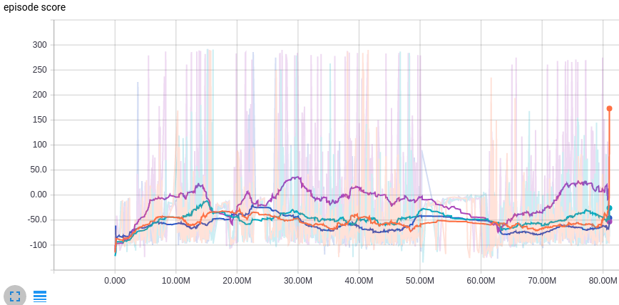

## [Algorithms](../README.md#contents)
> click on title to go to contents
- [Distributed A3C](#distributed-a3c)
    - [Distributed A3C Architecture](#distributed-a3c-architecture)
    - [Performance on some of the Atari Environments](#performance-on-some-of-the-atari-environments)
- [Distributed A3C Continuous](#distributed-a3c-continuous)
    - [Distributed A3C Architecture with Continuous Actions](#distributed-a3c-architecture-with-continuous-actions)
    - [Performance on gym's Walker](#performance-on-gyms-walker)
- [Distributed TRPO with GAE](#distributed-trpo-with-gae)
    - [Performance on gym's BipedalWalker](#performance-on-gyms-bipedalwalker)
- [Other Algorithms](#other-algorithms)

### [Distributed A3C](#algorithms)
Inspired by original [paper](https://arxiv.org/abs/1602.01783) - Asynchronous Methods for Deep Reinforcement Learning from [DeepMind](https://deepmind.com/)

#### [Distributed A3C Architecture](#algorithms)

**Environment (Client)** - each client connects to a particular Agent (Learner).

The main role of any client is feeding data to an Agent by transferring:
state, reward and terminal signals (for episodic tasks if episode ends).
Client updates these signals at each time step by receiving the action
signal from an Agent and then sends updated values to it.

- _Process State_: each state could be pass through some filtering
procedure before transferring (if you defined). It could be some color,
edge or blob transformations (for image input) or more complex
pyramidal, Kalman's and spline filters.

**Agent (Parallel Learner)** - one or more Agents can connect to a Global Learner.

The main role of any agent is to perform main training loop.
Agent synchronize their neural network weights with global network by
copying the last one at the beginning of the loop. Agent performs
N steps of Client's signals receiving and sending actions back.
These N steps is similar to batch collection. If batch is collected
Agent computes the loss (wrt collected data) and pass it to Optimizer.
RMSProp optimizer computes gradients, which sends to the Global Learner
to update their neural network weights. Several Agents work in parallel
and can update global network in concurrent way.

- _Agent's Neural Network_: we use the network architecture from this [Mnih's paper](https://arxiv.org/abs/1312.5602) (by default).
    - _Input_: 3D input to pass through 2D convolutions (default: 84x84x4).
    - _Convolution Layer #1_: 16 filters with 8x8 kernel and stride 4 in both directions, then ReLU applies (by default).
    - _Convolution Layer #2_: 32 filters with 4x4 kernel and stride 2 in both directions, then ReLU applies (by default).
    Sequence of two convolutions allows to define nonlinearity dependencies.
    - _Fully connected Layer_: consists of 256 hidden units, then ReLU applies (by default).
    - _Policy_: outputs number of units equals to action size, passed through softmax operator (by default).
    It is Actor's output, which represents Q-values on unity distribution (equals to probability) of state-action value function - Q(s, a).
    - _Value_: outputs one value without applying of additional operators (by default).
    It is Critic's output, which represents value function output V(s) - how well this state (equals to expected return from this point).

- _Total Loss_: it's scalar sum of value and policy loss.
    - _Value Loss_: sum (over all batch samples) of squared difference between
    total discounted reward (R) and a value of the current sample state - V(s),
    i.e. expected accumulated reward from this time step.
    `R = ri + gamma * V(s from N+1_step)`, where
     `ri` - immediate reward from this sample,
     `gamma` - discount factor (constant for the model),
     `V(s from N+1_step)` - value of the state next to the N-th state,
      if next state is terminal then `V = 0`.

    - _Policy Loss_: output of the policy (P) is an array of probability
     distribution over all possibly actions for the given sample state.
     Batch of samples is concatenated to the matrix.
     `Policy Loss = log(P) * A * TD + entropy`, where
     `A` - one-hot vectors for the chosen action of each sample.
     `log(P) * A` - produce sparse matrix, which we reduce to a column vector.
     `TD = (R - V)` - temporary difference between total discounted reward (R)
     and a value of the current sample state V(s) - produce column vector.
     `entropy = -sum(P * log(P), index=1) * entropy_beta_coefficient`,
     after multiplying the policy (P) likelihood we sum the result matrix
     by rows to produce a column vector. Then multiplying by `entropy_beta_coefficient = 0.01`
     Finally we sum up all column vectors and reduce it to a scalar.

- _Softmax Action_: we choose more often the actions, which has more probability.
It helps to explore a lot of state-action pairs at the beginning of the training.
We will become more confident in some actions while training
and the probability distribution is becoming more acute.
It also helps to solve a problem of "path along the cliff" with high reward at the end.

- _RMSProp Optimizer_: we use this type of optimizer wrt original paper.
RMSProp is more customizable optimizer than Adam for instance and you
can get better result if you fit it with appropriate parameters.
We set `learning rate = 7e-4` for RMSProp and linear anneal this value through
the training process wrt global training step. We also setup `decay = 0.99`
and `epsilon = 0.01` for the optimizer. Agent's RMSProp just used to
compute gradients wrt current Agent's neural network weights and given loss,
while all moments and slots of optimizer are stored (and shared) at Global Learner.

- _Gradients_: we clip computed gradients before transferring.

    `output_grads = computed_grads * 40.0 / l2norm(computed_grads)`

- _Synchronize Weights_: we copy weights from Global network to
Agent's network every training loop (N steps passed).

**Global Learner** - one for whole algorithm (training process).

The main role of the Global Learner is updating of its own neural network weights
by receiving gradients from the Agents and sending these weights to Agents
to synchronize. Global Learner can be sharded to speedup the training process.

- _Global Neural Network_: network architecture is similar to Agent's one.

- _RMSProp Optimizer_: has the same parameters as Agent's one,
but used only to apply receiving gradients. This RMSProp
stores moments and slots that are global for all Agents.

You can also specify hyperparameters for training in provided `params.yaml` file:

    episode_len: 5                  # training loop size for one batch
    max_global_step: 1e8            # amount of maximum global steps to pass through the training
    initial_learning_rate: 7e-4     # initial learning rate
    entropy_beta: 0.01              # entropy regularization constant
    rewards_gamma: 0.99             # discount factor for rewards
    RMSProp:                        # optimizer's parameters
       decay: 0.99
       epsilon: 0.1
       gradient_norm_clipping: 40

#### [Performance on some of the Atari Environments](#algorithms)
Breakout with DA3C-FF and 8 parallel agents: score performance is similar to DeepMind [paper](https://arxiv.org/pdf/1602.01783v2.pdf#19)

Boxing with DA3C-FF and 8 parallel agents: ih this case we outperforms significantly DeepMind, but
we have some instability in training process (anyway DeepMind shows only 34 points after 80mil steps)

### [Distributed A3C Continuous](#algorithms)
Distributed version of A3C algorithm, which can cope with continuous action space.
Inspired by original [paper](https://arxiv.org/abs/1602.01783) - Asynchronous Methods for Deep Reinforcement Learning from [DeepMind](https://deepmind.com/)

#### [Distributed A3C Architecture with Continuous Actions](#algorithms)

Most of the parts are the same to previous scheme, excluding:

- _Signal Filtering_: perform by Zfilter `y = (x-mean)/std` using running estimates of mean and std
 inspired by this [source](http://www.johndcook.com/blog/standard_deviation/). You can filter both
 states and rewards. We use it only for states by default.

- _Agent's (Global) Neural Network_: we use the similar architecture to [A3C paper](https://arxiv.org/pdf/1602.01783v2.pdf#12).
    Each continuous state passes some filtering procedure before transferring to _Input_ by default.
    - _Input_: vector of filtered state input (default: 24).
    - _Fully connected Layer_: consists of 128 hidden units, then ReLU applies (by default).
    - _LSTM_: consists of 128 memory cells (by default).
    - _Value_: outputs one value without applying of additional operators (by default).
    It is Critic's output, which represents value function output V(s) - how well this state (equals to expected return from this point).
    - _Policy_: Actor's output is divided separately on `mu` and `sigma`
        - _mu_: scalar of linear output.
        - _sigma_: applying SoftPlus operator, outputs a scalar.

    You can also specify your own architecture in provided JSON file.

- _Choose Action_: we use a random sampling wrt given `mu` and `sigma`

- _Total Loss_: it's scalar sum of value and policy loss.
    - _Value Loss_: the same to previous scheme.
    - _Policy Loss_: `GausNLL * TD + entropy`

    `GausNLL` is gaussian negative-log-likelihood

    `GausNLL = (sum(log(sigma), index=1) + batch_size * log(2*pi))/2 - sum(power, index=1)`,

     where `power = (A - mu)^2 * exp(-log(sigma)) * -0.5` - produce column vector.

     `TD = (R - V)` - temporary difference between total discounted reward (R)
     and a value of the current sample state V(s).

    `entropy = -sum(0.5 * log(2 * pi * sigma) + 1, index=1) * entropy_beta_coefficient`,

     resulting sparse matrix we sum over rows to produce column vector.

    `entropy_beta_coefficient = 0.001`

We also use a smaller `learning rate = 1e-4`

#### [Performance on gym's Walker](#algorithms)

##### [Server Latency](#algorithms)
Measure how fast Agent returns Action in response to the State sent by the Client

| Node Type  | Number of clients | Latency  |
| ---------- |:-----------------:|:--------:|
| m4.xlarge  |          32       | 323.23ms |
| m4.xlarge  |          48       | ???ms    |
| m4.xlarge  |          64       | ???ms    |
| c4.xlarge  |          48       | ???ms    |
| c4.xlarge  |          64       | ???ms    |
| c4.xlarge-m4.xlarge | 64       | ???ms    |
| c4.xlarge-m4.xlarge | 96       | ???ms    |
| c4.xlarge-m4.xlarge | 128      | ???ms    |
| c4.2xlarge |          232      | ???ms    |
| c4.2xlarge |          271      | ???ms    |

TBD - Latency chart (Show latency of the agents over time)

##### [Compute Performance with different amount of clients and node types (AWS)](#contents)

| Node Type  | Number of clients | Performance       |
| ---------- |:-----------------:| -----------------:|
| m4.xlarge  |          32       | 99 steps per sec  |
| m4.xlarge  |          48       | 167 steps per sec |
| m4.xlarge  |          64       | 171 steps per sec |
| c4.xlarge  |          48       | 169 steps per sec |
| c4.xlarge  |          64       | 207 steps per sec |
| c4.xlarge-m4.xlarge | 64       | 170 steps per sec |
| c4.xlarge-m4.xlarge | 96       | 167 steps per sec |
| c4.xlarge-m4.xlarge | 128      | 177 steps per sec |
| c4.2xlarge |          232      | 232 steps per sec |
| c4.2xlarge |          271      | 271 steps per sec |
  

### [Distributed TRPO with GAE](#algorithms)
Distributed version of TRPO-GAE algorithm, which can cope with both continuous & discrete action space.

Inspired by original papers:

- [Trust Region Policy Optimization](https://arxiv.org/abs/1502.05477)
- [High-Dimensional Continuous Control Using Generalized Advantage Estimation](https://arxiv.org/abs/1506.02438)

The main pipeline of the algorithm is the similar to the original sources, but collecting of
trajectories is performed independently by parallel agents. These agents have a copy of
policy neural network to rollout trajectories from its client.
Parameter server is blocked to update when the batch is collected and this procedure repeats.

#### [Performance on gym's BipedalWalker](#algorithms)
`batch_size == 10.000, trajectory_length == 1600, parallel_agents == 8`

  

### [Other Algorithms](#algorithms)
These other algorithms we are working on and planning to make them run on RELAAX server:

* ACER (A3C with experience)
Inspired by:
    - [Sample Efficient Actor-Critic with Experience Replay](https://arxiv.org/abs/1611.01224)

* UNREAL
Inspired by:
    - [Reinforcement Learning with Unsupervised Auxiliary Tasks](https://arxiv.org/abs/1611.05397)

* Distributed DQN (Gorila)
Inspired by:
    - [Massively Parallel Methods for Deep Reinforcement Learning](https://arxiv.org/abs/1507.04296)

* PPO with L-BFGS (similar to TRPO)
Inspired by:
    - [John Schulman's modular_rl repo](https://github.com/joschu/modular_rl)

* CEM
Inspired by:
    - [Cross-Entropy Method for Reinforcement Learning](https://esc.fnwi.uva.nl/thesis/centraal/files/f2110275396.pdf)

* DDPG
Inspired by:
    - [Continuous control with deep reinforcement learning](https://arxiv.org/abs/1509.02971)
