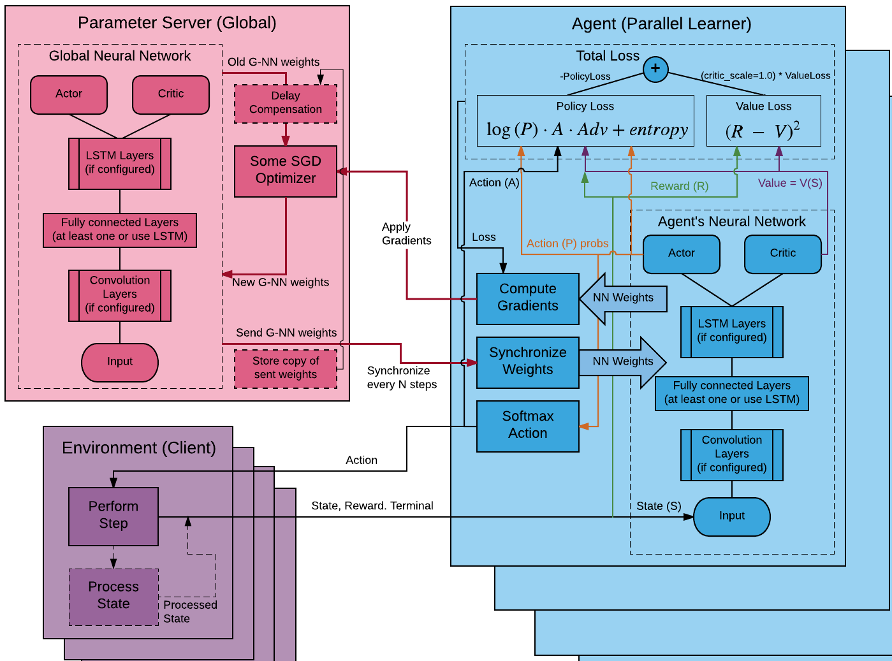
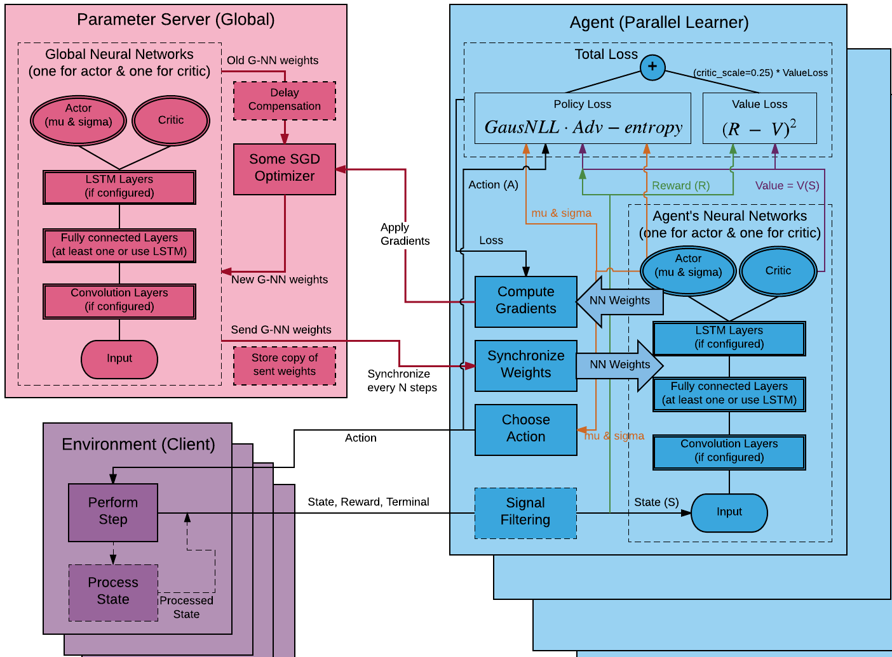

## [Algorithms](../README.md#contents)
> click on title to go to contents
- [Distributed A3C](#distributed-a3c)
    - [Distributed A3C Architecture](#distributed-a3c-architecture)
    - [Distributed A3C Continuous](#distributed-a3c-continuous)
    - [Intrinsic Curiosity Model for DA3C](#intrinsic-curiosity-model-for-da3c)
    - [Distributed A3C Config](#distributed-a3c-config)
    - [Performance on some of the Atari Environments](#performance-on-some-of-the-atari-environments)
    - [Performance on some Continuous Control Tasks](#performance-on-some-continuous-control-tasks)
- [Distributed TRPO with GAE](#distributed-trpo-with-gae)
    - [Performance on gym's BipedalWalker](#performance-on-gyms-bipedalwalker)
- [Distributed DDPG](#distributed-ddpg)
    - [Distributed DDPG Architecture](#distributed-ddpg-architecture)
    - [Distributed DDPG Config](#distributed-ddpg-config)
    - [D-DDPG Performance on Continuous Control Tasks](#d-ddpg-performance-on-continuous-control-tasks)
- [Distributed Policy Gradient](#distributed-policy-gradient)
    - [Distributed Policy Gradient Architecture](#distributed-policy-gradient-architecture)
    - [Distributed Policy Gradient Config](#distributed-policy-gradient-config)
    - [Performance on some Classic Control Tasks](#performance-on-some-classic-control-tasks)
- [Other Algorithms](#other-algorithms)

### [Distributed A3C](#algorithms)
Inspired by original [paper](https://arxiv.org/abs/1602.01783) - 
Asynchronous Methods for Deep Reinforcement Learning from [DeepMind](https://deepmind.com/)

It is actor-critic algorithm, which learns both a policy and a state-value function, and the value function
is used for bootstrapping, i.e., updating a state from subsequent estimates, to reduce variance and
accelerate learning.

In DA3C, parallel actors employ different exploration policies to stabilize training, so that experience
replay is not utilized. Different from most deep learning algorithms, this distributed method can
run on the multiple nodes with centralised parameter server. For Atari games, DA3C ran much faster yet
performed better than or comparably with DQN, Gorila, D-DQN, Dueling D-DQN, and Prioritized D-DQN.
Furthermore DA3C also performs better than original A3C or it synchronous variant, which called A2C. 
DA3C also succeeded on continuous motor control problems: TORCS car racing games and MujoCo physics
manipulation and locomotion, and Labyrinth, a navigating task in random 3D mazes using visual inputs,
in which an agent will face a new maze in each new episode, so that it needs to learn a general strategy
to explore random mazes. 

There are original pseudo code for A3C:

DA3C maintains a policy 
and an estimate of the value function ,
being updated with _n_-step returns in the forward view, after every _t__max_ actions or
reaching a terminal state, similar to using minibatches. In contrast to the original code we use processes
for the agents instead of threads, where each agent or some set of agents can be run on separate node.   

The gradient update can be represented with _TD_-error multiplier as in original paper

or with an estimate of the _advantage_ function:
,
where

with _k_ upbounded by _t__max_.
To use the last one just set config parameter `use_gae` to `true`.
The full set of possible config setups would be described later.
Gradients are also applied with delay compensation on the server parameter for better convergence.  

#### [Distributed A3C Architecture](#algorithms)

**Environment (Client)** - each client connects to a particular Agent (Learner).

The main role of any client is feeding data to an Agent by transferring:
state, reward and terminal signals (for episodic tasks if episode ends).
Client updates these signals at each time step by receiving the action
signal from an Agent and then sends updated values back.

- _Process State_: each state could be pass through some filtering
procedure before transferring (if you defined). It could be some color,
edge or blob transformations (for image input) or more complex
pyramidal, Kalman's and spline filters.

**Agent (Parallel Learner)** - each Agent connects to the Parameter Server.

The main role of any agent is to perform a main training loop.
Agent synchronize their neural network weights with the global network
by copying the last one weights at the beginning of each training mini loop.
Agent executes N steps of Client's signals receiving and sending actions back.
These N steps is similar to batch collection. If batch is collected
Agent computes the loss (wrt collected data) and pass it to the Optimizer.
It could be some SGD optimizer (ADAM or RMSProp) which computes gradients
and sends it to the Parameter Server for update of its neural network weights.
All Agents works absolutely independent in asynchronous way and can update or 
receive the global network weights at any time.

- _Agent's Neural Network_: we use the neural network architecture similar to [universe agent](https://github.com/openai/universe-starter-agent/blob/master/model.py) (by default).
    - _Input_: `3D` input to pass through `2D` convolutions (default: `42x42x1`) or any other shape.
    - _Convolution Layers : `4` layers with `32` filters each and `3x3` kernel, stride `2`, `ELU` activation (by default).
    - _Fully connected Layers_: one layer with `256` hidden units and `ReLU` activation (by default).
    - _LSTM Layers_: one layer with `256` cell size (by default it's replaced with fully connected layer).
    - _Actor_: fully connected layer with number of units equals to `action_size` and `Softmax` activation (by default).  
    It outputs an `1-D` array of probability distribution over all possibly actions for the given state.
    - _Critic_: fully connected layer with `1` unit (by default).  
    It outputs an `0-D` array representing the value of an state (expected return from this point).

- _Total Loss_ _`= Policy_Loss + critic_scale * Value_Loss`_  
    It uses `critic_scale` parameter to set a `critic learning rate` relative to `policy learning rate`  
    It's set to `0.5` by default, i.e. the `critic learning rate` is `2` times smaller than `policy learning rate`
    
    - _Value Loss_: sum (over all batch samples) of squared difference between
    expected discounted reward `(R)` and a value of the current sample state - `V(s)`,
    i.e. expected discounted return from this state.  
    ,
    where 
    with _k_ upbounded by _t__max_.  
    If _st_ is terminal then _V(st) = 0_.

    - _Policy Loss_:  
      
     where the 1-st term is multiplication of policy log-likelihood on advantage function,  
     and the last term is entropy multiplied by regularization parameter `entropy_beta = 0.01` (by default).

- _Compute Gradients_: it computes the gradients wrt neural network weights and total loss.   
    Gradients are also clipped wrt parameter `gradients_norm_clipping = 40.0` (by default).  
    To perform the clipping, the values `nn_weights[i]` are set to:

      nn_weights[i] * clip_norm / max(global_norm, clip_norm)

    where:

      global_norm = sqrt(sum([l2norm(w)**2 for w in nn_weights]))

    If `clip_norm > global_norm` then the entries in `nn_weights` remain as they are,  
    otherwise they're all shrunk by the global ratio.  
    To avoid clipping just set `gradients_norm_clipping = false` in config yaml.

- _Synchronize Weights_: it synchronize agent's weights with global neural network by copying  
    the last one to replace its own at the beginning of each batch collection step
    (_1..t__max_ or _terminal_).  
    The new step will not start until the weights are updated, but it allows to switch  
    this procedure in non-blocking manner by setting `hogwild` to `true` in the code.

- _Softmax Action_: it uses a `Boltzmann` distribution to select an action, so it chooses more  
    often actions, which has more probability and we called this `Softmax` action for simplicity.  
    This method has some benefits over classical _e_-greedy strategy and helps to avoid problem  
    of "path along the cliff". Furthermore it helps to explore more at the beginning of the training.  
    Agent becomes more confident in some actions while training and the probability distribution  
    over actions is becoming more acute.

**Parameter Server (Global)** - one for whole algorithm (training process).

The main role of the Parameter Server is to synchronize neural networks weights between Agents.  
It holds the shared (global) neural network weights, which is updated by the Agents gradients,  
and sent the actual copy of its weights back to Agents to synchronize.

- _Global Neural Network_: neural network weights is similar to Agent's one.

- _Some SGD Optimizer_: it holds a SGD optimizer and its state (`Adam | RMSProp`).  
    It is one for all Agents and used to apply gradients from them.  
    The default optimizer is `Adam` with `initial_learning_rate = 1e-4`  
    since the last one is linear annealing wrt `max_global_step` parameter.

#### [Distributed A3C Continuous](#algorithms)
Distributed version of A3C algorithm, which can cope with continuous action space.  
Architecture is similar to the previous one, but it uses two separate neural networks for `Policy` & `Critic`  
also with another `Actor` type, `Policy Loss`, `Choose Action` procedure  and additional state (reward) `filtering`.

- _Actor (Continuous)_: it outputs two values `mu` & `sigma` separately for `Normal` distribution.  
    They are represented by `2` fully connected layers with number of units equals to `action_size`.
    - _mu_: it applies a `Tanh` activation (by default) and represents the `mean` of the distribution.  
    It also allows to scale the output by config parameter `scale` or use another activation (or without it).
    - _sigma_: it applies a `SoftPlus` operator (by default), and represents the `variance` of the distribution.

- _Choose Action_: it uses a random sampling for exploration wrt `sigma`  
    and defines the final `action` wrt formula: _`random(action_size) * sigma + mu`_

- _Policy Loss_:   
    The full expansion of `Policy Loss` for `continuous` action space looks like as follows:  
      
  
    where the term before `advantage` represents a negative-log-likelihood (`NLL`)  
    and the term, which is multiplied by `beta` is `entropy` of `Normal` distribution.

- _Signal Filtering_: it uses the `running` estimate of the `mean` and `variance` wrt a stream of data.  
    Inspired by this [source](http://www.johndcook.com/blog/standard_deviation/).
    It allows to filter both `states` and `rewards` (it uses only for states by default).

#### [Intrinsic Curiosity Model for DA3C](#algorithms)

`DA3C` algorithm can also be extended with additional models.  
By default it can use a [ICM](https://arxiv.org/abs/1705.05363) by setting `use_gae` parameter to `True`.

`ICM` helps Agent to discover an environment out of curiosity when extrinsic rewards are spare
or not present at all. This model proposed an intrinsic reward which is learned jointly with Agent's policy
even without any extrinsic rewards from the environment. Conceptual architecture is shown in figure below:

#### [Distributed A3C Config](#algorithms)

You must specify the parameters for the algorithm in the corresponding `app.yaml` file to run:

    algorithm:
        name: da3c                  # name of the algorithm to load

    input:
        shape: [42, 42]             # shape of the incoming state from an environment
        history: 4                  # number of consecutive states to stack for input
        use_convolutions: true      # set to True to process input by convolution layers

    output:
        continuous: false           # set to True to use continuous Actor
        action_size: 18             # action size for the given environment
        scale: 2.5                  # multiplier to scale symmetrically continuous action
        action_low: [-3]            # lower bound (or list of values) to clip continuous action
        action_high: [2]            # upper bound (or list of values) to clip continuous action

    batch_size: 5                   # t_max for batch collection step size
    hidden_sizes: [256]             # list to define layers sizes after convolutions

    use_icm: true                   # set to True to use ICM module
    use_gae: true                   # set to True to use generalized advantage estimation
    gae_lambda: 1.00                # discount lambda for generalized advantage estimation

    use_lstm: true                  # set to True to use LSTM instead of Fully-Connected layers
    max_global_step: 1e8            # amount of maximum global steps to pass through the training

    optimizer: Adam
    initial_learning_rate: 1e-4     # initial learning rate which linear annealing through training

    entropy_beta: 0.01              # entropy regularization constant
    rewards_gamma: 0.99             # rewards discount factor
    gradients_norm_clipping: 40.    # value for gradients norm clipping

    icm:                            # ICM relevant parameters
        nu: 0.01                    # prediction bonus multiplier for intrinsic reward
        beta: 0.2                   # forward loss importance against inverse model
        lr: 1e-3                    # ICM learning rate

It allows to omit parameters that don't have sense for current setup
(it retrieves some from [default](https://github.com/deeplearninc/relaax/blob/641668e3b1b4a3c152b2c9fde83557a6c2f4e60a/relaax/algorithms/da3c/da3c_config.py)).  
It also could be helpful to use some notations to outline different versions of the `DA3C`.  
Therefore `DA3C-LSTM` is referred to architecture with `LSTM` layers and `DA3C-FF` otherwise.  
`Discrete DA3C-FF-GAE-ICM-16` outlines feedforward architecture with `discrete` actor,   
generalized advantage estimation (`GAE`) and curiosity model (`ICM`) with `16` Agents. 

**DA3C Graph sample from Tensorboard**

#### [Performance on some of the Atari Environments](#algorithms)
Performance of `Vanilla A3C` on classic `Atari` environments from [original paper](https://arxiv.org/pdf/1602.01783v2.pdf#page.19)
(`1` day = `80` millions of steps)

`DA3C-LSTM-GAE-8` with [Universe A3C architecture](https://github.com/openai/universe-starter-agent/blob/master/model.py) on Gym's Atari Pong
(see universe-starter-agent [result](https://github.com/4SkyNet/universe-starter-agent/tree/maze#atari-pong) to compare): 
  
`DA3C-FF-8` with [Vanilla A3C architecture](https://arxiv.org/pdf/1602.01783v2.pdf#page.12) on Gym's Atari Boxing:
  

#### [Performance on some Continuous Control Tasks](#algorithms)
`Continuous DA3C-LSTM-16` on BipedalWalker:

##### [Compute Performance with different amount of clients and node types (AWS)](#algorithms)

| Agent Node | PS Node    | Number of clients | Performance       |
|:----------:|:----------:|:-----------------:|:-----------------:|
| m4.xlarge  | m4.xlarge  |         32        | 99 steps per sec  |
| m4.xlarge  | m4.xlarge  |         48        | 167 steps per sec |
| m4.xlarge  | m4.xlarge  |         64        | 171 steps per sec |
| c4.xlarge  | c4.xlarge  |         48        | 169 steps per sec |
| c4.xlarge  | c4.xlarge  |         64        | 207 steps per sec |
| c4.xlarge  | m4.xlarge  |         64        | 170 steps per sec |
| c4.xlarge  | m4.xlarge  |         96        | 167 steps per sec |
| c4.xlarge  | m4.xlarge  |        128        | 177 steps per sec |
| c4.2xlarge | c4.2xlarge |        232        | 232 steps per sec |
| c4.2xlarge | c4.2xlarge |        271        | 271 steps per sec |
  

### [Distributed TRPO with GAE](#algorithms)
Distributed version of TRPO-GAE algorithm, which can cope with both continuous & discrete action space.

Inspired by original papers:

- [Trust Region Policy Optimization](https://arxiv.org/abs/1502.05477)
- [High-Dimensional Continuous Control Using Generalized Advantage Estimation](https://arxiv.org/abs/1506.02438)

The main pipeline of the algorithm is the similar to the original sources, but collecting of
trajectories is performed independently by parallel agents. These agents have a copy of
policy neural network to rollout trajectories from its client.
Parameter server is blocked to update when the batch is collected and this procedure repeats.

#### [Performance on gym's BipedalWalker](#algorithms)
`batch_size == 10.000, trajectory_length == 1600, parallel_agents == 8`

  

### [Distributed DDPG](#algorithms)
Inspired by original [paper](https://arxiv.org/abs/1509.02971) - 
Continuous control with deep reinforcement learning from [DeepMind](https://deepmind.com/)

It is actor-critic, model-free, deep deterministic policy gradient (DDPG) algorithm in continuous action spaces,   
by extending [DQN](http://www.nature.com/nature/journal/v518/n7540/full/nature14236.html?foxtrotcallback=true)
and [DPG](http://proceedings.mlr.press/v32/silver14.pdf).
With actor-critic as in DPG, DDPG avoids the optimization of action at every time step  
to obtain a greedy policy as in Q-learning, which will make it infeasible in complex action spaces with large,  
unconstrained function approximators like deep neural networks. To make the learning stable and robust,  
similar to DQN, DDPQ deploys experience replay and an idea similar to target network, ”soft” target, which,  
rather than copying the weights directly as in DQN, updates the soft target network weights θ′ slowly to track  
the learned networks weights θ: θ′ ← τθ + (1 − τ)θ′, with τ<=1.  The authors adapted batch normalization  
to handle the issue that the different components of the observation with different physical units.  
As an off-policy algorithm, DDPG learns an actor policy from experiences from an exploration policy  
by adding noise sampled from a noise process to the actor policy.

There are original pseudo code for DDPG:

#### [Distributed DDPG Architecture](#algorithms)

**Environment (Client)** - each client connects to a particular Agent (Learner).

The main role of any client is feeding data to an Agent by transferring:
state, reward and terminal signals (for episodic tasks if episode ends).
Client updates these signals at each time step by receiving the action
signal from an Agent and then sends updated values back.

- _Process State_: each state could be pass through some filtering
procedure before transferring (if you defined). It could be some color,
edge or blob transformations (for image input) or more complex
pyramidal, Kalman's and spline filters.

**Agent (Parallel Learner)** - each Agent connects to the Parameter Server.

The main role of any agent is to perform a main training loop.
Agent synchronize their neural network weights with the global network
by copying the last one weights at the beginning of each update procedure.
Agent executes `1` step (TBD `N` steps) of Client's signals receiving and sending actions back,
then it stores this interaction tuple `state | action | reward | next_state` in the `Replay Buffer`.
These N steps is similar to batch collection. If `Replay Buffer` has enough samples
to retrieve a batch of size, defined by config parameter `batch_size`, 
Agent computes the loss (wrt collected data) and pass it to the Optimizer.
It uses ADAM optimizer (by default) which computes gradients and sends them
to the Parameter Server for update of its neural network weights.
All Agents works absolutely independent in asynchronous way and can update or 
receive the global network weights at any time.

- _Agent's Neural Networks_: `4` neural networks -> `Actor` & `Actor Target`, `Critic` & `Critic Target`
    - _Input_: input with shape consistent to pass through `2D` convolutions or to fully connected layers.
    - _Convolution Layers : defined by relevant dictionary or use [default](https://github.com/deeplearninc/relaax/blob/641668e3b1b4a3c152b2c9fde83557a6c2f4e60a/relaax/common/algorithms/lib/layer.py#L223-L226).
    - _Fully connected Layers_: set of layers defined by parameter `hidden_sizes` and `ReLU` activation (by default).
    - _Actor_: fully connected layer with number of units equals to `action_size` and no activation (by default).  
    It outputs an `1-D` array, which represents `Q` values over all possibly actions for the given state.
    - _Critic_: fully connected layer with `1` unit (by default).  
    It outputs an `0-D` array representing the value of an state (expected return from this point).

- _Critic Loss_: it computes loss for the `Critic` neural network with the baselines as `Target` networks.  
    ,
    where _N_ is a `batch_size` and
    .

- _Actor Loss_: it computes loss for the `Actor` neural network wrt `Critic` network.  
    ,
    where _N_ is a `batch_size`.

- _Compute Gradients_: it computes the gradients wrt neural network weights and relevant loss.  
    Gradients are computed only for `Actor` & `Critic` neural networks, not for `Target` ones.

- _Synchronize Weights_: it synchronize agent's weights with global neural networks by copying  
    the last ones to replace its own at the beginning of each batch collection step.  
    The new step will not start until the weights are updated.
    
- _Define Action_: it chooses an action with maximum `Q` value.  
    Actions are summed up with some noise, which annealing through the training  
    or (it recommended) to use `Ornstein–Uhlenbeck` process to generate noise by  
    setting parameter `ou_noise` in config to `True`  
    ,
    where _Nt_ is the noise process.

- _Noise Process_: it generates `noise` to add it into action.

- _Replay Buffer_: it holds a tuples `state | action | reward | next_state`  
    in a cyclic buffer with the size defined by parameter `buffer_size`.  
    Samples are retrieved from this buffer to perform an update  
    with the size defined by parameter `batch_size`.

- _Signal Filtering_: it uses the `running` estimate of the `mean` and `variance` wrt a stream of data.  
    Inspired by this [source](http://www.johndcook.com/blog/standard_deviation/).
    It allows to filter both `states` and `rewards` (it uses only for states by default).

**Parameter Server (Global)** - one for whole algorithm (training process).

The main role of the Parameter Server is to synchronize neural networks weights between Agents.  
It holds the shared (global) neural networks weights, which is updated by the Agents gradients,  
and sent the actual copy of its weights back to Agents to synchronize.

- _Global Neural Networks_: neural networks weights is similar to Agent's one.

- _ADAM Optimizers_: it holds two ADAM optimizers for `Actor` and `Critic` neural networks.  
    Optimizer's states are global for all Agents and used to apply gradients from them.  
    It applies gradients only for `Actor` & `Critic` neural networks, not for `Target` ones.  
    Then soft update for `Targets` networks are performed wrt parameter `tau`:  
      
    

#### [Distributed DDPG Config](#algorithms)
You must specify the parameters for the algorithm in the corresponding `app.yaml` file to run:

    algorithm:
        name: ddpg                  # name of the algorithm to load

    input:
        shape: [3]                  # shape of the incoming state from an environment
        history: 1                  # number of consecutive states to stack for input
        use_convolutions: false     # set to True to process input by convolution layers

    output:
        action_size: 1              # action size for the given environment
        scale: 2.0                  # multiplier to scale symmetrically continuous action

    hidden_sizes: [400, 300]        # list of dense layers sizes, for ex. [128, 64]
    batch_size: 64                  # batch size, which needs for one network update
    buffer_size: 10000              # local buffer size to sample experience (400k-1m)
    rewards_gamma: 0.99             # rewards discount factor

    actor_learning_rate: 0.0001     # actor learning rate
    critic_learning_rate: 0.001     # critic learning rate
    tau: 0.001                      # rate of target updates

    l2: true                        # set to True to add l2 regularization loss for the Critic
    l2_decay: 0.01                  # regularization constant multiplier for l2 loss for Critic
    ou_noise: true                  # set to True to use Ornstein–Uhlenbeck process for the noise

    exploration:                    # exploration parameters wrt Ornstein–Uhlenbeck process
        ou_mu: 0.0
        ou_theta: 0.15
        ou_sigma: 0.20
        tau: 25

    log_lvl: INFO                   # additional metrics output wrt levels: INFO | DEBUG | VERBOSE
    no_ps: false                    # set to True to perform training without parameter server

It allows to omit parameters that don't have sense for current setup
(it retrieves some from [default](https://github.com/deeplearninc/relaax/blob/641668e3b1b4a3c152b2c9fde83557a6c2f4e60a/relaax/algorithms/ddpg/ddpg_config.py).  

#### [D-DDPG Performance on Continuous Control Tasks](#algorithms)
`Distributed DDPG` with `4 Agents` on classic `Pendulum` continuous control task: 

  

### [Distributed Policy Gradient](#algorithms)
It is classical method based on `REINFORCE`
[(Williams, 1992)](http://www-anw.cs.umass.edu/~barto/courses/cs687/williams92simple.pdf) rule.

Policy Gradient (or `PG`) maintains a policy 
and similar to `DA3C` being updated with _n_-step returns in the forward view, after every _t__max_
actions or reaching a terminal state, similar to using minibatches.

It is updating _θ_ in the direction of:
,  
where 
with _k_ upbounded by _t__max_.

#### [Distributed Policy Gradient Architecture](#algorithms)
The principal architecture is similar to [DA3C](#distributed-a3c-architecture) except that it works  
only with one `Policy` neural network and always uses `Discrete` actor.

**Environment (Client)** - each client connects to a particular Agent (Learner).

The main role of any client is feeding data to an Agent by transferring:
state, reward and terminal signals (for episodic tasks if episode ends).
Client updates these signals at each time step by receiving the action
signal from an Agent and then sends updated values back.

- _Process State_: each state could be pass through some filtering
procedure before transferring (if you defined). It could be some color,
edge or blob transformations (for image input) or more complex
pyramidal, Kalman's and spline filters.

**Agent (Parallel Learner)** - each Agent connects to the Parameter Server.

The main role of any agent is to perform a main training loop.
Agent synchronize their neural network weights with the global network
by copying the last one weights at the beginning of each training mini loop.
Agent executes N steps of Client's signals receiving and sending actions back.
These N steps is similar to batch collection. If batch is collected
Agent computes the loss (wrt collected data) and pass it to the Optimizer.
It uses an ADAM optimizer which computes gradients and sends it to the
Parameter Server for update of its neural network weights.
All Agents works absolutely independent in asynchronous way and can update or 
receive the global network weights at any time.

- _Agent's Neural Network_:
    - _Input_: input with shape consistent to pass through `2D` convolutions or to fully connected layers.
    - _Convolution Layers : defined by relevant dictionary or use [default](https://github.com/deeplearninc/relaax/blob/641668e3b1b4a3c152b2c9fde83557a6c2f4e60a/relaax/common/algorithms/lib/layer.py#L223-L226).
    - _Fully connected Layers_: set of layers defined by parameter `hidden_sizes` and `ReLU` activation (by default).
    - _Actor_: fully connected layer with number of units equals to `action_size` and `Softmax` activation (by default).  
    It outputs an `1-D` array of probability distribution over all possibly actions for the given state.

- _Policy Loss_:  
    ,
    where 
    with _k_ upbounded by _t__max_.

- _Compute Gradients_: it computes the gradients wrt neural network weights and policy loss.  

- _Synchronize Weights_: it synchronize agent's weights with global neural network by copying  
    the last one to replace its own at the beginning of each batch collection step
    (_1..t__max_ or _terminal_).  
    The new step will not start until the weights are updated.

- _Softmax Action_: it uses a `Boltzmann` distribution to select an action, so it chooses more  
    often actions, which has more probability and we called this `Softmax` action for simplicity.  
    This method has some benefits over classical _e_-greedy strategy and helps to avoid problem  
    of "path along the cliff". Furthermore it helps to explore more at the beginning of the training.  
    Agent becomes more confident in some actions while training and the probability distribution  
    over actions is becoming more acute.

**Parameter Server (Global)** - one for whole algorithm (training process).

The main role of the Parameter Server is to synchronize neural networks weights between Agents.  
It holds the shared (global) neural network weights, which is updated by the Agents gradients,  
and sent the actual copy of its weights back to Agents to synchronize.

- _Global Neural Network_: neural network weights is similar to Agent's one.

- _Adam Optimizer_: it holds optimizer's state.  
    It is one for all Agents and used to apply gradients from them.  

#### [Distributed Policy Gradient Config](#algorithms)
You must specify the parameters for the algorithm in the corresponding `app.yaml` file to run:

    algorithm:
        name: policy_gradient       # name of the algorithm to load

    input:
        shape: [4]                  # shape of the incoming state from an environment
        history: 1                  # number of consecutive states to stack for input
        use_convolutions: false     # set to True to process input by convolution layers

    output:
        action_size: 2              # action size for the given environment

    hidden_sizes: [10]              # list to define layers sizes after convolutions
    batch_size: 200                 # t_max for batch collection step size
    learning_rate: 0.01             # learning rate for the optimizer
    GAMMA: 0.99                     # rewards discount factor

#### [Performance on some Classic Control Tasks](#algorithms)
`Distributed Policy Gradient` with `4 Agents` on classic `CartPole` task: 
  
  

### [Other Algorithms](#algorithms)
These other algorithms we are working on and planning to make them run on RELAAX server:

* ACER (A3C with experience)
Inspired by:
    - [Sample Efficient Actor-Critic with Experience Replay](https://arxiv.org/abs/1611.01224)

* UNREAL
Inspired by:
    - [Reinforcement Learning with Unsupervised Auxiliary Tasks](https://arxiv.org/abs/1611.05397)

* Distributed DQN (Gorila)
Inspired by:
    - [Massively Parallel Methods for Deep Reinforcement Learning](https://arxiv.org/abs/1507.04296)

* PPO with L-BFGS (similar to TRPO)
Inspired by:
    - [John Schulman's modular_rl repo](https://github.com/joschu/modular_rl)

* CEM
Inspired by:
    - [Cross-Entropy Method for Reinforcement Learning](https://esc.fnwi.uva.nl/thesis/centraal/files/f2110275396.pdf)
